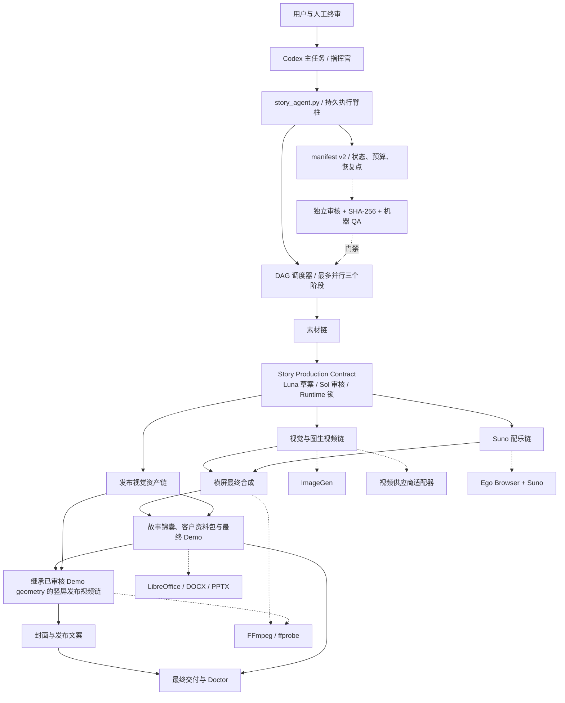

# 系统总体架构

## 目标

系统把一个横屏绿幕口播原片转化为完整故事产品。它不是单一模型调用，而是“用户入口、持久状态机、阶段 worker、模型任务、确定性工具”五层协作系统。

## 五层含义

### 1. 用户与 Codex 主任务

负责理解目标、处理异常、向用户请求验证码或必要授权、解释结果。它不应代替持久状态机保存进度。

### 2. StoryAgent

`story_agent.py` 接收任务、更新 registry 和 manifest、选择可运行阶段、启动 DAG worker、执行暂停/恢复/取消，并将关键任务路由到指挥官或工人模型。

### 3. DAG 阶段 worker

每个阶段有明确依赖、分支、写集合和资源锁。默认最多三个阶段并行，但 ImageGen、视频 API、Suno、FFmpeg 等资源各自有容量限制。

### 4. 模型任务

需要认知判断或生成时，阶段会启动独立 `codex exec`。关键审核走 Sol；普通生产和工具执行走 Luna。一次阶段可以因审核失败产生多次模型任务。

### 5. 确定性工具

FFmpeg、文件复制、哈希、CSV、JSON、LibreOffice 和测试属于确定性执行。能由脚本完成的工作不应消耗大模型上下文。

## 合同层

新任务在高成本分支前形成七节 Story Production Contract。它不是另一个人工表单：Runtime 编译可信输入链，Luna 起草，Sol 独立审核，Runtime 原子锁定。下游只消费所需 projection；分镜和音乐通过结构化 Agent 指令消费，图生视频、封面、发布视频和资料包的可确定部分进入底层 jobs/render/content spec。合同变化目前按模块族失效，逐镜头图属于后续 Runtime 里程碑。

## V3.5 Milestone 2 质量链

Milestone 2 在同一合同事实源上补强生产质量，而没有建立平行规则系统：逐产物语义计划与条件式视觉小样先阻断错误批量扩散；视频 jobs 携带逐镜动作、承接和来源 receipt；keying QA 与正式渲染共享同一生产滤镜指纹；Demo、Release、封面和产品包分别写入可复验的 geometry/render/lineage/content manifest。能确定性执行的 Logo、坐标、安全区、文本选择和来源 currentness 由代码控制，审美、动作自然度与融合感继续由独立多模态审核负责。

这些能力目前通过离线 fixture 和模拟供应商验证工程机制。它们不等于真实 ImageGen、Grok、Suno 或新人物素材已经达到产品验收标准；真实供应商 canary、完整新故事生产和用户验收仍未完成。

## 项目目录角色

- `00_输入素材`：原片、确认文本和来源副本；不得覆盖原片。
- `01_分镜与图片`：故事分镜、图片、视觉圣经和连续性计划。
- `02_图生视频`：视频 jobs、提示词、生成片段和配乐中间产物。
- `03_背景成片`：横屏背景视频、字幕、时长和混音结果。
- `04_发布视频`：主账号、宝库号、抠像与主题资产。
- `05_发布物料`：封面与文案。
- `06_资料包`：客户可见基础版和进阶版。
- `99_项目状态`：manifest、成本、QA、审核、日志和异常；不能混入客户包。

## 当前架构的主要风险

1. 主任务、StoryAgent、DAG worker、`codex exec` 和临时协作 Agent 都可能承担部分调度，身份层级不够透明。
2. 阶段重试仍可能让模型重新读取过大的上下文。
3. 自动状态机之外的手工恢复没有完整计入耗时、Token 和成本。
4. 哈希审核可靠，但大目录反复打包与读取会增加延迟。
5. 模型执行日志与账户周额度没有统一账本。
