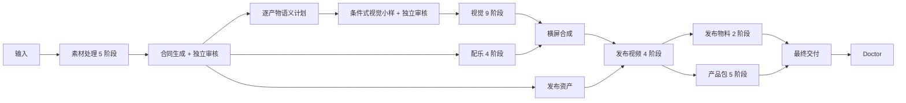

# V3.5 当前的 38 阶段 DAG

权威定义位于 `story_agent_runtime.py` 的 `STORY_STAGE_SEQUENCE`、`STORY_STAGE_DEPENDENCIES`、`STAGE_WRITE_SETS` 和 `STAGE_RESOURCES`。

## 阶段表

| 分支 | 顺序 | 阶段 |
| --- | --- | --- |
| 素材 | 1—5 | `import_inbox` → `source_edit` → `source_text_correction` → `source_edit_review` → `setup_project` |
| 合同 | 6—7 | `story_contract` → `story_contract_review` |
| 语义与视觉前置 | 8—10 | `artifact_semantic_plan` → `visual_samples` → `visual_sample_review` |
| 视觉 | 11—19 | `codex_story_images` → `story_images_review` → `prepare_jobs` → `timing` → `video_prompt_review` → `generate_videos` → `video_qa` → `video_review` → `apply_review` |
| 配乐 | 20—23 | `music_request` → `suno_generate` → `assemble_music` → `music_qa` |
| 汇合 | 24 | `assemble_final` 同时等待 `apply_review` 与 `music_qa` |
| 发布资产 | 25 | `release_assets` 在合同审核通过后即可并行 |
| 发布视频 | 26—29 | `release_preview` → `package_release` → `release_qa` → `release_video_review` |
| 发布物料 | 30、36 | `publish_package` → `publish_package_review` |
| 产品包 | 31—35 | `product_preflight` → `product_annotation` → `product_annotation_review` → `product_package` → `product_package_review` |
| 交付 | 37—38 | `final_delivery` → `doctor` |

## 并行资源上限

默认 DAG `max_parallel=3`，但资源容量进一步约束：

| 资源 | 容量 | 典型使用者 |
| --- | ---: | --- |
| `codex_exec` | 2 | 模型生产与独立审核 |
| `imagegen` | 1 | 故事图片、主题资产、封面 |
| `browser_suno` | 1 | Suno 浏览器会话 |
| `video_api` | 1 | 图生视频提交 |
| `paid_work` | 1 | 付费任务预算门禁 |
| `ffmpeg_heavy` | 1 | 横屏、竖屏和产品视频渲染 |

因此“最多三个 worker”不等于三个 ImageGen 或三个 FFmpeg 同时运行。

## 完成判定

阶段完成不是“文件存在”，而是对应 predicate 全部满足。关键产物还必须：

1. 通过机器 QA；
2. 生成标准审核 bundle；
3. bundle 中每个文件哈希仍为当前版本；
4. 独立审核分数至少 85；
5. `critical_errors` 为空；
6. 决策文件与当前 jobs 精确匹配。

V3.5 新任务还必须先通过合同门禁：Luna 生成草案，Sol 在独立上下文审核七个 section，Runtime 重新校验 bundle/review SHA-256 后 crash-safe 写入 `story_contract.lock.json`。任何半写、字段缺失或绑定哈希不匹配都等于未锁定。V3 冻结项目不补造合同；只有 Runtime 根据基线日期、历史阶段和绑定 receipt 判定为真正历史项目时，两个合同阶段才采用 `legacy_passthrough`。

锁定合同通过后，Runtime 先确定性编译 `artifact_semantic_plan`，再按合同实际内容建立条件式视觉小样计划。小样优先复用合同审核中已有的预览；只有缺少所需证据时才补生成风格、角色、尺度或状态小样。`visual_sample_review` 同时检查机器完整性、合同遵守和产品质量，P0 不可被高总分抵消。小样锁、语义计划或合同 projection 变化后，旧 storyboard plan 不再 current；小样未通过时不会进入批量 ImageGen。

## 重试原则

- 只隔离失败镜头，不删除旧版本。
- jobs 必须以 `target_video_filename` 逐一核对。
- 提示词、图片或连续性状态变化后，旧审核失效。
- 不允许仅修改 manifest 状态来绕过审核。
- 长期目标是变更镜头增量审核；当前部分阶段仍存在大范围重读与返工放大。
- 合同消费者目前按 section projection 做模块族级失效；它能避免品牌变化重做故事图片，但还不是逐镜头依赖图。
