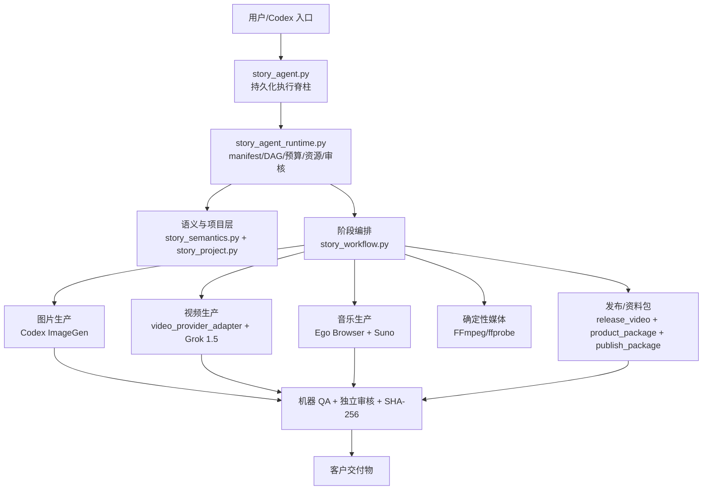

# Story Agent V3 正式基线

冻结日期：2026-08-12  
真实生产样本：《小壁虎借尾巴》  
正式基线标签：`story-agent-v3-baseline-2026-08-12`

## 基线声明

V3 是一套已经跑完整链路的生产系统基线，不是质量已经收敛的终点。

它真实完成了：输入审计、故事语义、分镜和图片、连续性合同、图生视频、配乐、背景成片、主账号/宝库号发布视频、六张封面、文案、PPT、朗读标注、基础版/进阶版资料包、机器 QA 和哈希绑定独立审核。

它尚未做到：在无人看管条件下稳定选择正确画风、设计可爱角色、保持真实尺度、理解细粒度故事状态、产生自然动效、达到用户认可的抠像和商业版式，并以准确账本解释耗时、Token 和费用。

正式成熟度定义为：

> **生产链路完成，工程安全和产物完整性可复核；产品审美与用户验收尚未通过。**

## 冻结范围

| 范围 | 冻结对象 |
| --- | --- |
| 功能代码 | 提交 `cf587c6` 及其历史：完成《小壁虎借尾巴》最终交付的代码状态。 |
| 知识库快照 | 提交 `eb72131`：架构、DAG、模型路由、合同、运行手册和初版复盘。 |
| 正式基线 | 标签 `story-agent-v3-baseline-2026-08-12`：本文件、用户终验台账、修订复盘、证据哈希和 V3.5 范围。 |
| 生产样本 | 本地 `auto-project/runs/故事剪辑：小壁虎借尾巴`，不提交媒体到 Git。 |
| 用户反馈 | Feedback TXT 和 21 张截图保留在用户环境；仓库只记录摘要和 SHA-256。 |

旧标签 `v3.1-lizard-tail-baseline` 保留，不移动、不删除。它代表 Feedback 进入前的技术快照；本标签代表用户 Feedback 合并后的正式 V3 产品基线。

## 真实表现

| 维度 | V3 事实 |
| --- | --- |
| 项目状态 | DAG `completed`；最终客户目录齐全。 |
| 成片时长 | 约 2 分 53 秒。 |
| 故事镜头 | 19 个当前视频；至少 30 次付费生成调用。 |
| 日历跨度 | 约 45 小时 25 分，含睡眠、断网、额度中断和等待。 |
| 用户观察实际工作 | 约 18 小时。 |
| manifest 活跃时间 | 18,466.47 秒，约 5 小时 07 分；明显漏记。 |
| Token 下限 | 2,229,711；仅统计能从日志复原的 11/14 次 Codex exec。 |
| 视频计费量 | 267 秒、至少 30 次调用；534 credits / 页面标价 `$2.67`。 |
| 人民币实扣 | 未知；必须以 ToAPIs 账单和充值换算为准。 |
| 自动成本报告 | `CNY 2.37 / 237 秒 / 27 次`，已判定不可靠。 |
| 测试 | 2026-08-12 使用 `/opt/miniconda3/bin/python3 -m unittest discover -s tests -v` 重新验证，176 项全部通过。 |
| 用户验收 | 反馈不通过；作为 V3.5 的真实输入，不重做样本。 |

完整数字、推算方法和限制见 [`../postmortems/2026-08-lizard-tail.md`](../postmortems/2026-08-lizard-tail.md)。

## V3 架构

V3 的核心是一个 33 阶段 DAG。Sol 作为指挥官和关键审核者，Luna Max 作为生产工人；外部能力通过 ImageGen、Suno、Grok 和 FFmpeg 完成。详细结构见：

- [`../architecture/overall-architecture.md`](../architecture/overall-architecture.md)
- [`../architecture/stage-dag.md`](../architecture/stage-dag.md)
- [`../architecture/model-routing.md`](../architecture/model-routing.md)
- [`../contracts/review-and-safety.md`](../contracts/review-and-safety.md)

## V3 的能力边界

### 已具备

- 原片不可变、复制工作和哈希审计。
- 可续跑的 manifest 和 DAG。
- 连续性合同和逐镜目标文件匹配。
- 视频供应商适配层和自适应秒数。
- 音乐输入哈希 QA。
- 抠像候选、尾帧、画框、黑块、字幕、文档渲染等机器检查。
- 独立上下文审核、85 分门槛、关键错误为空、产物哈希绑定。
- 客户资料包与内部 QA/成本目录隔离。

### 尚不具备

- 正确产品意图先于批量生产的合同审核。
- 可靠的默认画风和角色审美策略。
- 角色/物体世界尺度连续性。
- 支持故事特有中间状态的连续性状态机。
- 动效质量与静态降级禁用门禁。
- 统一品牌规范、跨比例版式模板和参考图几何合同。
- 真实请求级成本、币种、Token、等待和人工恢复账本。
- 用户可读的 Agent 树和关键路径。
- `internal_qa_passed` 与 `user_accepted` 的明确状态分离。

## 为什么高分审核仍然未通过用户验收

V3 的审核链主要回答三个问题：文件是否存在并可解码、产物是否遵守当前合同、有没有灾难性视觉错误。用户终验回答的是另三个问题：合同本身对不对、画面和版式是否好看、客户是否愿意使用。

例如，视觉圣经人为规定头顶橄榄斑，审核就会把每镜都保持该斑点视为成功；连续性合同规定 17 镜完整再生，审核就会把 17–19 的完整尾巴视为成功。高分不是伪造，而是审核目标错位。V3.5 必须改变合同形成和验收层次，而不是仅增加相同审核次数。

## 冻结规则

1. 不修改或覆盖《小壁虎借尾巴》现有交付物；它是 V3 真实样本。
2. 不移动旧标签，不重写历史提交。
3. V3 的缺陷只在文档中标记，不为提高分数而回填审核 JSON。
4. V3.5 从新分支 `codex/v3.5-quality-modularization` 开始；每个模块改造独立提交。
5. V3.5 必须能与本标签比较和回退；迁移测试通过前保留旧 CLI。
6. 媒体、用户原片、密钥、浏览器会话和原始对话不进入 Git。
7. 所有基线外部证据通过 [`V3_FREEZE_MANIFEST.json`](V3_FREEZE_MANIFEST.json) 复核。

## V3.5 进入条件

- 本基线和 Feedback 台账已经提交并打正式标签。
- V3.5 实施范围已经冻结，不把接 DeepSeek、多供应商自动路由、去 Codex 或动态 PPT 混入第一阶段。
- 每个 P0/P1 问题都有归属模块、验收标准和最小回归样本。
- 第一批改造先“装插座”和修真实质量问题，不大爆炸式重写 33 阶段 DAG。

实施范围见 [`../roadmaps/V3.5_QUALITY_AND_MODULARIZATION.md`](../roadmaps/V3.5_QUALITY_AND_MODULARIZATION.md)。
