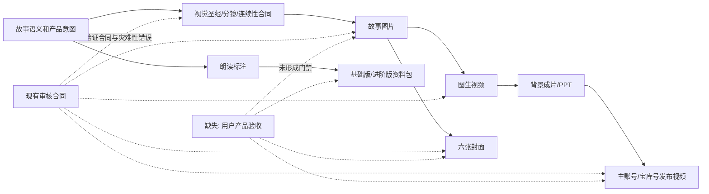

# 《小壁虎借尾巴》V3 用户终验台账

## 结论

《小壁虎借尾巴》证明 V3 已经能够从经过确认的绿幕视频、文稿和字幕一路生成完整交付包，但还不能被称为“无人看管即可稳定达到产品审美”的系统。

本次最重要的发现不是审核没有运行，而是审核非常认真地验证了一个不完整、部分错误的生产合同。故事图片、视频、抠像、发布视频、发布物料、朗读标注和资料包分别取得 92–96 分，关键错误均为空；用户仍发现了画风、角色设计、比例、尾巴生长逻辑、动效、抠像、字幕、版式和表演指导等系统性问题。这说明 V3 的哈希门禁和工程完整性有效，但“合同正确性、审美质量、客户使用体验”尚未成为正式门禁。

## 证据范围

- 用户 Feedback：38,107 bytes，SHA-256 `2347ad2c92172ab05b504254d162827fd589eee93b6d0ac2a8db0c8f8ff79488`。
- 用户截图：21 张，逐项覆盖抠像、故事画面、PPT 字幕、发布视频、上下包装和封面版式。截图保留在会话/本地附件，不提交 Git。
- 生产样本：`auto-project/runs/故事剪辑：小壁虎借尾巴`。
- 运行与成本事实见 [`../postmortems/2026-08-lizard-tail.md`](../postmortems/2026-08-lizard-tail.md)。
- 产物哈希见 [`V3_FREEZE_MANIFEST.json`](V3_FREEZE_MANIFEST.json)。

## 已经做对的部分

| ID | 模块 | 用户确认的优点 | V3.5 处理 |
| --- | --- | --- | --- |
| S-01 | 文本/资料包 | 客户文稿正确去掉主持人自我介绍和报幕，正文可用。 | 保留语义分流思想，修正不同产物的具体策略。 |
| S-02 | 音乐 | 配乐正常，无明显问题。 | 不做重构优先项，只保留输入哈希和 QA。 |
| S-03 | 示范视频 | 真人正确；没有再次粗暴缩小；模糊背景比旧版自然；没有黑色丑块。 | 作为人物原生构图基准。 |
| S-04 | 发布视频 | A/B/C 镜切换已经存在；C 镜和 B 镜的基本含义正确。 | 保留切换机制，修正 A 镜几何合同。 |
| S-05 | 资料包 | A 镜无人物背景视频的画框大小和位置基本正确。 | 作为无人物版基准。 |
| S-06 | 宝库号 | 水印正确；约 30 秒后模糊保护正确。 | 保留确定性水印与模糊规则。 |
| S-07 | 视频供应商 | Grok Video 1.5 便宜、稳定性尚可，严重崩坏不多。 | V3.5 继续使用，先优化上游图片与提示词。 |
| S-08 | 工程安全 | 用户原片未被覆盖；关键产物有哈希审核；19 个目标镜头和资料包完整。 | 继续作为不可破坏规则。 |

## 问题传播关系

画风、角色外观、大小比例和尾巴状态一旦在视觉圣经中定义错误，后续视频、PPT、发布视频和封面会忠实地放大这个错误。V3.5 必须把关键产品决策前置，不能依靠末端多审几次补救。

## 完整问题台账

优先级说明：P0 会使整套产品方向错误或让错误批量扩散；P1 明显影响客户观感或可用性；P2 是体验改进或研究项。

| ID | 优先级 | 归属模块 | 用户观察 | 已确认根因 | V3.5 去向 |
| --- | --- | --- | --- | --- | --- |
| SRC-01 | P1 | 输入/剪辑 | 原片最前面误保留一次单独的故事标题。以后正式原片应从“大家好”开始。 | prepared 入口接受整段确认视频，没有“裸标题前卷”语义标记。 | 增加可审计的 pre-roll 检测/人工确认；不得静默改用户原片。 |
| SEM-01 | P0 | 语义合同 | 背景视频、PPT、宝库号都没有片头；示范视频又缺主持人开场字幕。 | 现有语义合同只解决“客户文稿/销售字幕不含主持人口播”，没有为每种产物定义独立语义轨。 | 建立逐产物语义矩阵。主持人口播期间背景显示标题卡；示范字幕保留主持人口播；客户文稿仍去掉主持人口播。 |
| SEM-02 | P1 | 字幕 | 故事结尾已经出现道理卷轴，仍叠加字幕，信息重复。 | 视觉镜头允许道理文字，字幕策略和图像策略独立，未做跨层去重。 | 道理镜头采用“画面文字或字幕二选一”的显式合同；销售版默认不重复道理字幕。 |
| IMG-01 | P0 | 生图 | 普通儿童故事再次被做成平面 2D 中国风，用户更偏好可爱 3D 卡通。 | 视觉圣经直接写入“中国风 2D 儿童绘本卡通”，没有故事类型到画风的受控决策，也没有用户确认。 | 普通儿童故事默认 3D 可爱卡通；文化/历史/用户指定才使用 2D 中国风；完整出图前确认风格锚点。 |
| IMG-02 | P0 | 生图 | 小壁虎、小鱼等角色不够可爱，头顶莫名出现叶片/圆斑。 | 为保持一致性，视觉圣经人为发明“头顶深橄榄色斑、脸部浅点”等标识；审核又把这些标识当作正确项。 | 身份锚点必须自然、少量、故事相关；禁止为一致性凭空添加奇怪器官或装饰。先审角色设定，再批量出图。 |
| IMG-03 | P0 | 生图/连续性 | 壁虎相对墙、蛇和其他动物过大；跨镜大小忽大忽小；鱼的比例也漂移。 | 连续性合同管了颜色、斑点和尾巴枚举，没有世界尺度、角色身高比和景别下的允许范围。 | 增加角色尺度表、同场比例图、场景参照物和跨镜 scale drift 审核。 |
| IMG-04 | P0 | 生图/故事语义 | 断尾后长期无尾，到见妈妈前突然完整长出，不符合用户理解的逐步再生。 | 合同只有 `tail_intact / break / missing / regrown`，并把 17–19 全设为完整再生；系统正确执行了过粗且语义不充分的合同。 | 支持故事级中间状态：鱼前无尾、牛处少量生长、燕子处进一步生长、见妈妈时完整；状态边界需在完整出图前审核。 |
| IMG-05 | P0 | 生图审核 | 19 张基础图一开始就不够漂亮，却以 93 分通过，后续全部继承。 | 审核重点是角色数量、解剖、硬连续性和禁项，没有“可爱度、审美、比例、风格适配、关键角色吸引力”。 | 生图审核拆为合同校验、视觉审美和用户代理验收；关键角色/风格先做小样闸门。 |
| VID-01 | P0 | 生视频/片头 | “大家好…今天讲《小壁虎借尾巴》”期间没有正式标题卡，第一镜直接承担了错误任务。 | 分镜从正文镜头开始，标题卡不是一等镜头；语义分流只删字幕，没有生成视觉替代。 | 把 title card 作为非付费、确定性片头资产和时间段，正文“一天……”才切第一故事镜。 |
| VID-02 | P1 | 生视频 | 动作慢、僵硬、不连贯，镜头之间缺少视觉承接。 | 原画基础弱；提示词为了禁止长尾加入大量静止/锁定约束；运动计划只描述单镜动作，缺少入镜/出镜和相邻镜头衔接。 | 每镜增加主体动作、环境动作、镜头运动和前后衔接；设置最低运动质量；禁止用“完全静止”掩盖连续性困难。 |
| VID-03 | P0 | 生视频/降级 | 维持不了无尾时使用静态图片，用户明确不能接受。 | 现有降级策略把连续性优先于运动质量，静态帧仍可通过完整性 QA。 | 静态 fallback 不得作为正式交付；改为重提示、局部重做、替代运动策略或阻塞人工处理。 |
| VID-04 | P2 | 视频架构 | 单图生视频能力上限明显；用户希望以后研究参考生视频。 | 当前 Grok 1.5 只接收单张首图，无法把角色、场景、动作和镜头参考同时作为输入。 | V3.5 只保留能力接口，不接多供应商自动路由；Flow/Omni、Seedance 等进入后续实验清单。 |
| VID-05 | P1 | 生视频提示词 | 当前 Grok 结果稳定但不生动，不能简单归因于模型。 | 视觉圣经、原画、尺寸合同和防长尾约束共同限制了输出；模型只是一环。 | 先做上游 A/B 对照再评价模型；每次只改变一个变量。 |
| DEMO-01 | P1 | 抠像/示范视频 | 肩、手臂、裙边存在明显硬边/暗边，与背景融合不自然。 | 单组色键候选通过了可见性和无裁切审核，但没有把边缘融合、溢色和局部放大观感作为拒绝条件。 | 高分辨率发丝/肩/手/裙边四类局部对比；抠像评分加入边缘色差与融合质量。 |
| DEMO-02 | P1 | 示范视频 | 画面过素；应在右上角放小号官方 Logo。 | 示范视频模板没有统一品牌安全区与官方 Logo 输入。 | 只接受官方 Logo 资产；右上角小尺寸、固定安全边距、全片一致。 |
| DEMO-03 | P1 | 示范字幕 | “大家好、我是……、今天讲……”字幕缺失。 | 示范视频错误复用销售字幕语义，而不是完整表演字幕语义。 | 示范视频字幕从主持人开场开始，覆盖报幕和正文；单独测试首 15 秒。 |
| DEMO-04 | P1 | 示范视频背景 | 模糊背景左上出现边界清楚的局部色块/拼接痕。 | 现有审核只检查主体、裁切和明显黑块，没有检查背景局部块状不连续；仅凭截图尚不能判定来自背景生成、滤镜还是合成层。 | 加入低频块状边界/拼接异常检测；审核证据固定包含四角和背景空白区，修复前先定位具体合成层。 |
| ANN-01 | P1 | 朗读标注 | 重音漏掉“一条蛇、慌忙逃跑、小鱼、小河边、老黄牛、小燕子、称呼和功能动作”，反而反复强调“爬呀爬”。 | 重音生成偏向局部韵律，没有主语—谓语—对象、角色称呼、地点和功能词的句法层规则。 | 建立可解释重音规则；用“谁—做什么—对谁/在哪里”检查；重复过渡词默认不重读。 |
| ANN-02 | P1 | 朗读标注 | “声音突然收紧、不把可怕感演太重、带着希望赶路”等指导抽象、干巴、难执行。 | 指导模板输出文学化概括，没有面向家长/幼师的具体动作、语速、音量和示例。 | 每条指导用简单可执行语言：哪里停、哪几个字加重、快慢/高低、可选表情；禁止空泛评价。 |
| ANN-03 | P1 | 朗读标注 | 手腕轻摆、手掌转方向等动作显得莫名其妙；栏目名“情绪”和标题“表演化批注脚本”生硬。 | 模板强行给每段配肢体动作，并使用内部术语。 | 动作只在自然且有帮助时作为可选项；栏目统一“表演指导”；标题统一“《故事名》表演指导”。 |
| PPT-01 | P1 | PPT | 含字幕 PPT 黑条和字号过大，常占两行；旧版更轻更小。 | 代码虽限制两行/相对高度，但阈值仍不符合真实参考；没有基于客户观感的视觉基准图。 | 默认单行、小号低位字幕条；只有极端长句才二行；用参考图和像素比例做回归。 |
| PPT-02 | P2 | PPT 研发 | 用户希望研究每页可动的动态 PPT。 | 当前 PPT 只嵌静态图，不研究 GIF/视频/兼容模式。 | 作为 V3.5 之后的独立实验，不阻塞核心质量修正。 |
| REL-01 | P1 | 宝库号发布视频 | 顶部包装奇怪，`2分53秒` 位于角落而不是视觉中心。 | 发布板生成/审核只验证文字存在、边界和可读性，没有检查语义分组、对齐和版式重心。 | 用确定性双条模板和锚点布局；对文字框中心、边距、层级做机器检查和视觉验收。 |
| REL-02 | P0 | 主账号包装 | 上下包装没有遵循用户给出的简洁双条参考，持续生成复杂大板。 | 参考图和“两张 2304×888 独立上下图”的几何合同没有成为模板输入；生成式设计自由度过高。 | 先固化上/下两张独立资产的尺寸、字段和留白，生成只负责装饰；版式由确定性合成控制。 |
| REL-03 | P0 | 主账号 A 镜 | 人物再次被缩小、显得矮；仍站中央，没有移到右侧空白区。 | A 镜只按目标框 fit 人物，没有“保持原生缩放、只移动 X”的合同；审核只看不裁切和框完整。 | A 镜继承示范视频人物尺度，固定在中右分界附近；只允许水平位移和安全边界修正。 |
| REL-04 | P1 | 发布视频抠像 | C/A 镜沿用不自然的抠像边缘。 | 发布合成复用已经通过但审美不足的 keying preset。 | 抠像 preset 审核失败时，下游全部阻塞；不再由发布视频末端单独容忍。 |
| COV-01 | P0 | 封面/品牌 | 自创“绵羊姐姐讲故事”牌与官方 Logo 同时出现，官方 Logo 还被放得很大、居中，重复且丑。 | 生图允许模型生成品牌字样，后处理又确定性叠官方 Logo；没有品牌元素唯一性合同。 | 生成阶段禁止任何品牌/Logo/文字；后处理只放一个官方 Logo，默认左上角小号，也可按模板完全不放。 |
| COV-02 | P0 | 封面版式 | 3:4、4:3、16:9 标题歪、偏、不在上部水平中心；无人物版也不居中。 | 同一套模糊布局规则跨比例复用，缺少按人物占位和比例定义的标题安全框/中心线。 | 为 3:4、4:3、16:9 × 有人/无人建立 6 套确定性几何模板和可视化安全区。 |
| COV-03 | P1 | 封面审核 | 发布物料审核 95 分却没有指出重复 Logo 和标题重心。 | 审核 rubric 偏文字正确、真人一致、无裁切和尺寸，不含品牌规范与版式比较。 | 品牌唯一性、标题中心偏移、占比、层级和参考模板相似度成为硬检查。 |
| PUB-01 | P2 | 发布文案 | 用户本轮没有使用/审核发布文案。 | 系统把“已生成”视为完整价值，但实际使用优先级未记录。 | 保留模块，降低 V3.5 优先级；未来由真实使用反馈决定。 |
| QA-01 | P0 | 总审核 | 多个 92–96 分审核与用户终验明显冲突。 | 一层审核同时承担文件完整、合同遵守和产品质量；错误合同通过后，审核会奖励错误的一致性。 | 四层门禁：机器完整性、合同正确性、审美/产品审核、用户验收；前两层不能代替后两层。 |
| QA-02 | P0 | 合同审核 | 视觉圣经本身的画风、奇怪斑点和尾巴阶段没有在批量生成前被否决。 | 生产者生成合同，后续审核只验证产物是否遵守合同，没有独立审核合同是否符合故事和用户偏好。 | 增加“合同评审”节点：风格、角色、尺度、状态机、片头和文字策略先审后产。 |
| QA-03 | P1 | 用户验收 | 系统结束时宣称完成，但没有正式记录用户最终产品签收。 | `completed` 表示 DAG 产物和内部审核完成，不等于用户接受；人工 signoff 未成为版本结论。 | 状态区分 `production_complete`、`internal_qa_passed`、`user_accepted`；本项目冻结为前两者完成、用户反馈不通过。 |
| RT-01 | P0 | 重试/缓存 | 一处问题导致大批重生和整包复审，生图 5 次、图片审核 6 次。 | 阶段哈希粒度过粗；镜头/合同/版式没有内容寻址的局部依赖图。 | 镜头级冻结、重做、审核和缓存；只失效真正受影响的下游。 |
| RT-02 | P1 | Token/上下文 | 至少 222.97 万 Token，图片生产和审核占 69.4%。 | 每次 Agent 重新探索仓库、故事、全部证据；没有最小阶段上下文包和固定输出模式。 | 为每阶段生成内容寻址 context pack；脚本处理确定性检查；限制复审证据范围。 |
| RT-03 | P1 | 调度/可观察性 | 约 18 小时实际工作、45 小时日历跨度；20 多个子 Agent 对用户是黑箱。 | Agent 身份、父子关系、资源锁、等待原因和关键路径没有统一时间线；Luna Max 慢只是放大因素之一。 | 实时 Agent 树、关键路径、资源占用、等待/运行时长和阶段 ETA；默认限制并发身份和重试次数。 |
| RT-04 | P0 | 成本 | manifest 写 ¥2.37/237 秒/27 次；实际备份链至少 267 秒/30 次，页面报价又是美元。 | 预算只记录估算，币种字段写死 CNY，重试没有逐请求自动入账。 | 每次付费请求记录 provider/request_id/秒数/credits/报价币种/估算/账单实扣；未知实扣不得标 `settled`。 |
| RT-05 | P1 | 运行账本 | manifest 只记录约 5:07 活跃时间，漏掉人工恢复和后期制作。 | 状态机外恢复没有统一事件 API；后期节点沿用“已有产物满足”导致尝试数为 0。 | 所有人工恢复、迁移、审核重绑定和产物接管写事件；区分自动与人工工时。 |
| RT-06 | P1 | 人工预览 | 已生成面向人的图生视频预览页，但用户不看，投入没有产生价值。 | 产物仍来自半自动工作台时代，没有消费方和必经门禁。 | 若无人消费则取消；若保留则成为明确、可签收的抽样节点。 |

## 审核错位的直接证据

| 审核 | 分数 | 审核认为正确 | 用户终验指出 |
| --- | ---: | --- | --- |
| 故事图片 | 93 | 头顶橄榄斑、脸点和 17–19 完整新尾保持一致。 | 斑点本身难看且多余；17 镜突然完整再生是语义逻辑错误。 |
| 图生视频 | 93 | 19 镜、95 帧无灾难性崩坏；两个镜头低运动只是 minor。 | 整体僵硬、断续，静态 fallback 不能接受。 |
| 抠像 | 92 | 人物完整、不裁切、背景无大块错误。 | 肩、手臂和裙边硬边明显，融合不自然。 |
| 发布视频 | 94 | 尾帧、黑框、画框、水印、模糊均通过；抠像暗边记为 minor。 | A 镜缩小且站错位置；上下包装不符合参考；抠像仍不可接受。 |
| 发布物料 | 95 | 六图尺寸、文字、真人一致性通过。 | 重复 Logo、标题不居中、跨比例版式失衡。 |
| 朗读标注 | 96 | 正文覆盖、文档渲染、示范裁切通过。 | 重音逻辑、指导语言、动作设计和命名均不够可用。 |
| 产品包 | 96 | 文件齐全、可解码、PPT 页数和目录结构通过。 | PPT 字幕太大、无片头，包内核心媒体继承上游质量问题。 |

因此，V3.5 不应简单增加更多同类审核；必须先改变审核对象和验收合同。

## 模块归属汇总

| 模块 | 问题 ID |
| --- | --- |
| 输入/语义 | SRC-01, SEM-01, SEM-02 |
| 生图/视觉连续性 | IMG-01–IMG-05 |
| 生视频 | VID-01–VID-05 |
| 音乐 | 无本轮质量缺陷；保留现有 QA |
| 抠像/示范视频 | DEMO-01–DEMO-04 |
| 朗读标注/资料包 | ANN-01–ANN-03, PPT-01, PPT-02 |
| 发布视频 | REL-01–REL-04 |
| 封面/发布物料 | COV-01–COV-03, PUB-01 |
| Runtime/调度/审核/成本 | QA-01–QA-03, RT-01–RT-06 |

## 对 V3 的最终判定

- 工程交付：通过。
- 当前合同下的机器 QA：通过。
- 当前合同下的独立审核：通过。
- 用户产品验收：不通过，需要在 V3.5 修正。
- 是否重做本项目：否。本项目作为 V3 真实基准保留。
- 是否现在大规模改代码：否。先冻结事实和范围，再在单独实施阶段进入 V3.5。

## 21 张截图索引

截图本身不进入 Git；下表记录本轮会话中的顺序、性质和对应问题，避免以后只能依赖对话回忆。第 12–15 张属于用户提供的目标参考，不是 V3 缺陷截图。

| 截图 | 性质 | 主要证据 | 对应问题 |
| ---: | --- | --- | --- |
| 01 | 缺陷 | 肩、手臂、裙边多处硬边/暗边。 | DEMO-01, REL-04 |
| 02 | 缺陷 | 模糊背景左上出现明显矩形色块/拼接边界。 | DEMO-04 |
| 03 | 缺陷 | 示范视频画面过素，品牌位为空。 | DEMO-02 |
| 04 | 缺陷 | 首镜壁虎相对墙和蛇过大。 | IMG-03 |
| 05 | 缺陷 | 动态视频首镜仍继承错误比例，动作与对象关系僵硬。 | IMG-03, VID-02 |
| 06 | 缺陷 | 小壁虎头顶出现无故事依据的叶片/斑块。 | IMG-02 |
| 07 | 缺陷 | 道理卷轴已有文字，底部又叠同义字幕。 | SEM-02 |
| 08 | 缺陷 | PPT 两行大字、黑色字幕条占比过高。 | PPT-01 |
| 09 | 缺陷 | PPT 单行字幕仍过大、视觉重心过低。 | PPT-01 |
| 10 | 缺陷 | 宝库号顶部包装复杂，时长被挤到右侧角落。 | REL-01 |
| 11 | 缺陷 | 主账号 C 镜人物边缘不自然。 | DEMO-01, REL-04 |
| 12 | 参考 | 用户给出上/下两张 2304×888 独立包装图的生成说明。 | REL-02 |
| 13 | 参考 | 历史故事的简洁上下包装与人物构图参考。 | REL-02, REL-03 |
| 14 | 参考 | 目标上条：只含故事类型和故事名。 | REL-02 |
| 15 | 参考 | 目标下条：只含时长、年龄和固定用途说明。 | REL-02 |
| 16 | 缺陷 | A 镜人物被缩小并仍位于中央，遮挡画框。 | REL-03 |
| 17 | 说明 | 用户标出人物应保持尺度、水平移动到右侧空白区。 | REL-03 |
| 18 | 缺陷 | 3:4 封面同时出现自创牌和官方 Logo，标题区偏移。 | COV-01, COV-02 |
| 19 | 缺陷 | 4:3 无人物封面标题未在上部水平居中。 | COV-02 |
| 20 | 缺陷 | 16:9 封面标题未在上部水平居中，并受 Logo 占位干扰。 | COV-01, COV-02 |
| 21 | 缺陷 | 3:4 有人物封面重复 Logo，标题位置失衡。 | COV-01, COV-02 |
