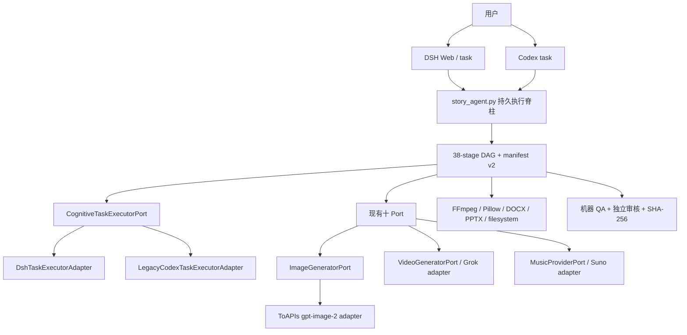

# Story Agent V3.5 → DeepSeek Harness 迁移交接书

日期：2026-08-21

目标平台：DeepSeek Harness（正式简称 `dsh`；不是另一个名为 Honeycomb 的独立产品）

迁移策略：Codex 与 DSH 两条线并行，互不读写运行目录，任何一侧都不作为另一侧的隐式 fallback

源码事实源：迁移包根目录 `MIGRATION_PACKAGE_MANIFEST.json` 中的 `source_git`

生产状态：V3.5 M1/M2/M3 工程实现已收口；实时看板、通知、恢复控制器和持久 supervisor 已实现；真实新故事 V3.5 Canary 尚未启动

外部调用状态：本交接与迁移包构建阶段为零 provider 调用

---

## 1. 先说结论

这个项目不应“重写成 DSH”。现有最有价值的部分是 Python 持久状态机、38 阶段 DAG、项目目录合同、十个 Port、Story Production Contract、哈希绑定独立审核、故障恢复和确定性媒体链。这些都与 Codex 无关，应该原样保留。

迁移应只替换两个真正的平台边界：

1. **认知任务执行边界**：现在是 `StoryAgent._codex_task()` → `codex exec`；目标是 provider-neutral `CognitiveTaskExecutorPort` → DSH headless/SDK adapter，同时保留 Codex adapter 作为兼容后端。
2. **图片生成边界**：现在是 `ImageGeneratorPort` → `CodexImageGeneratorAdapter` → Codex ImageGen；目标是新增 ToAPIs image adapter，明确区分 `gpt-image-2` 与 `gpt-image-2-official`，不改变图片计划、命名、staging、currentness 或审核门禁。

视频链已经通过 `video_provider_adapter.py` 解耦，FFmpeg/文档/抠像/封面确定性渲染已经是本地模块，Suno 也已经有 `MusicProviderPort`。因此无需因为换 Agent 宿主就重写这些模块。

推荐目标形态：



DSH 是新的操作入口和模型执行宿主，不是新的项目事实源。权威状态仍只在故事项目的 `99_项目状态`、各类 manifest/receipt/lock/review 文件以及源码定义的 predicate 中。

---

## 2. 用户意图与硬边界

### 2.1 用户要什么

- 保留当前 Codex 版本，继续在 Codex 中调优和运行后续 Canary。
- 在桌面建立一个完全独立、干净、可交给 DSH 的迁移副本。
- DSH 自己完成生态适配，因为它最了解自己的 CLI、SDK、plugin 和模型配置。
- 智能任务优先考虑 `deepseek-v4-pro` 和 `deepseek-v4-flash`；图像识别使用当前视觉实验模型；图像生成改走 ToAPIs。
- 两条线互不干扰：DSH 不改原 Codex worktree，不碰原 Canary；Codex 也不直接运行 DSH 副本的生产任务。
- 不再有“10 小时总运行上限”。只有单个外部/子进程调用的合理 watchdog、取消、心跳、磁盘和预算门禁。

### 2.2 本迁移阶段明确不做

- 不复制真实故事媒体、原片、17 张旧图、Suno 下载、客户资料包或任何 `auto-project` 运行目录。
- 不复制 `.git`、Codex/DSH session、浏览器 cookie、登录状态、Keychain export、`.env` 或本地 override。
- 不启动《爱比美的公鸡》或其他 Canary。
- 不调用 DeepSeek、ToAPIs、Grok、Suno、FMP 或任何付费 provider。
- 不在迁移第一阶段删除 Codex CLI 参数、Codex adapter 或旧 workbench。
- 不把 DSH 的模型回复当成完成证据；所有原 QA/哈希/receipt 规则继续生效。

### 2.3 双线隔离规则

| 项目 | Codex 线 | DSH 线 |
| --- | --- | --- |
| 工作区 | 原 Codex worktree | 本迁移包独立目录 |
| Agent home | `CODEX_HOME` / Codex 自己管理 | `DSH_HOME` / DSH 自己管理，必须在包外 |
| Git | 原分支继续演进 | DSH 副本自行 `git init` 或建立新远程，不复用原 `.git` |
| 真实故事项目 | 只在用户确认后由 Codex 线运行 | 首期禁止访问 |
| 密钥 | 系统安全存储/环境变量 | 独立环境变量/系统安全存储，不复制值 |
| provider receipt | 写入各自运行项目 | 不共享或伪造 |
| 回退 | 明确选择 backend | 禁止静默跨生态 fallback |

任何需要“同时改两边”的修复，应先以通用测试描述行为，再分别 cherry-pick/重做；不得让两个运行目录通过 symlink 或绝对路径互相写入。

---

## 3. 迁移包是什么

迁移包由 `scripts/build_dsh_migration_package.py` 从一个干净、已提交的 `HEAD` 构建。它不是工作树的递归复制。

构建器保证：

- 只读取 Git `HEAD` 中的 tracked 文件；dirty/untracked 内容不会被悄悄夹带。
- 不含 `.git`、忽略目录、媒体、项目输出、cache、密钥文件或本地配置 override。
- 包根 `AGENTS.md` 被替换为 DSH 迁移约束；原 Codex `AGENTS.md` 作为只读基线副本保存在 `docs/migration/AGENTS_CODEX_BASELINE.md`。
- 包根 `pipeline_config.json` 使用 `pipeline_config.dsh-template.json`，清空机器专属品牌素材路径和外部 Skill 绝对路径；不会复制原配置中的个人绝对路径。
- 写入 `MIGRATION_PACKAGE_MANIFEST.json` 和 sidecar SHA-256，逐文件绑定包内容、source commit、overlay 和排除项。
- 默认拒绝覆盖已经存在的目标目录。
- 构建与校验过程不导入 Story Agent、不启动 supervisor、不访问网络、不调用 provider。

迁移包中的源码仍会包含历史 helper/文档里的一些 Codex 名称或旧绝对路径说明，因为它们属于已提交历史兼容资料。权威迁移清单会生成 `nonportable_references` 报告；DSH 不应执行这些 legacy helper。真正会被默认读取的 `pipeline_config.json` 已经替换为脱敏模板。

### 3.1 迁移包首读顺序

1. 根目录 `AGENTS.md`。
2. 本文件。
3. `AI_CONTEXT.md`。
4. `docs/architecture/overall-architecture.md`。
5. `docs/architecture/stage-dag.md`。
6. `docs/architecture/module-ports.md`。
7. `docs/contracts/review-and-safety.md`。
8. `docs/contracts/story-production-contract.md`。
9. `docs/operations/runbook.md`。
10. `docs/migration/DSH_FIRST_PROMPT.md`。

### 3.2 包内不包含什么

- 原 Codex worktree 的 `.git` 和本地分支元数据。
- 桌面《爱比美的公鸡》项目；其中旧 17 张图片与归档记录只属于 Codex Canary 恢复链。
- `/Users/.../.codex/generated_images`、`output/story_agent_cli`、`99_项目状态` 或任何实际 story asset。
- `TOAPIS_API_KEY`、`DEEPSEEK_API_KEY`、Lark webhook、Suno/Codex 登录态。
- 外置硬盘上的品牌素材；迁移后必须由用户另行选择 DSH 测试资产或安全挂载路径。

---

## 4. 当前源码基线

### 4.1 已完成里程碑

- **V3 正式基线**：完整工程交付链存在，但历史项目用户产品验收不通过；不得用它证明 V3.5 产品质量。
- **V3.5 Milestone 1**：七节 Story Production Contract 前置、可信来源链、独立审核、crash-safe lock、最小 projection 和 consumer receipt。
- **V3.5 Milestone 2**：语义计划、条件式视觉小样、逐镜动作/连续性、正式 keying 证据、Demo/Release geometry、封面 lineage、产品包 currentness。
- **V3.5 Milestone 3**：十个版本化 Port、production adapter、显式 Registry、deterministic mock 与跨 Port 离线 smoke。
- **可观察性/恢复增量**：实时只读 dashboard、NDJSON event/notification、Codex 恢复判定器、持久 supervisor、heartbeat watchdog、启动前 preflight、stale image/state reconciliation。
- **固定时限退役**：manifest 继续兼容旧 `deadline_hours` 字段，但 Runtime 强制 `runtime_deadline_enabled=false`、`deadline_hours=0.0`。

### 4.2 当前安全点

包内 `MIGRATION_PACKAGE_MANIFEST.json` 是最终权威；构建前工作树应包含以下已完成提交链：

- `336b756 feat: add persistent Story Agent recovery`
- `f239f5b fix: retire runtime deadline and reconcile stale assets`

M3 基线来自 `6472f94 docs: close V3.5 milestone three` 及之前十 Port 提交。迁移文档自己的 commit 由 manifest 记录，避免在文档中写不可满足的自引用 SHA。

### 4.3 规模与验证基线

- 38 个唯一阶段，依赖完整、无环。
- 十个 Port v1。
- 迁移开始前 188 个 tracked 文件；迁移资料加入后以 package manifest 为准。
- 迁移开始前生产 Python 环境完整回归：454/454 passed。
- 加入本迁移交接、构建器与三项安全测试后，完整回归：457/457 passed。
- 系统 Python 可能缺少 `python-docx`；本机验证应优先使用 `/opt/miniconda3/bin/python3`，新机器则建立自己的依赖完整 venv。
- 真实 V3.5 新故事、真实 ImageGen/Grok/Suno 质量、真实费用和用户终验都尚未形成通过证据。

不要把上述“engineering complete”误写成“DSH migration complete”或“产品已经验证”。

---

## 5. 五层架构与权威事实源

### 5.1 五层

1. **用户入口**：今天是 Codex task；目标增加 DSH Web/task。它负责意图、异常解释和必要授权，不保存生产真相。
2. **持久 StoryAgent**：`story_agent.py` 负责 submit/start/status/resume/cancel/report、DAG worker、模型路由、恢复和 supervisor 对接。
3. **Runtime/DAG**：`story_agent_runtime.py` 定义 38 stages、依赖、资源容量、manifest v2、预算、锁和 currentness。
4. **模块 Port/Adapter**：`story_module_ports.py`、`story_module_registry.py`、`story_module_adapters.py` 提供十个可替换执行边界。
5. **确定性工具与质量层**：FFmpeg、Pillow、CSV/JSON、LibreOffice、hash、machine QA、独立 model review。质量政策在 Runtime/consumer，不在 adapter。

### 5.2 不能被 DSH session 取代的事实源

- `project_manifest.json` / `story_agent_state.json`。
- `story_contract.json`、trusted inputs、review bundle/review JSON、`story_contract.lock.json`。
- 六类 consumer request manifest 与 `.completed.json` receipt。
- jobs CSV 的精确 target filenames。
- image/video/music/keying/release/cover/product receipts 与 QA report。
- reviewer bundle 中每个 artifact SHA-256。
- control file 的 run epoch、cancel 状态、heartbeat 和 supervisor state。
- 成本事件和 provider request/task id。

DSH 的 session JSONL 只能作为额外执行日志，不能覆盖这些项目事实。

### 5.3 项目目录合同

| 目录 | 责任 |
| --- | --- |
| `00_输入素材` | 原片、派生清洁素材、剪辑决定；原片不可覆盖 |
| `01_分镜与图片` | 权威分镜、图片、视觉证据 |
| `02_图生视频` | jobs、prompt、provider 片段、配乐中间物 |
| `03_背景成片` | 横屏合成、字幕、timing、混音 |
| `04_发布视频` | 主账号/宝库号、keying 与主题资产 |
| `05_发布物料` | 两份文案、六张封面 |
| `06_资料包` | 客户可见基础版/进阶版 |
| `99_项目状态` | manifest、锁、QA、成本、日志、恢复、异常；不得混入客户包 |

---

## 6. 38 阶段 DAG

权威定义始终以 `story_agent_runtime.py` 为准。

| 分支 | 阶段 | 关键门禁 |
| --- | --- | --- |
| 素材 1—5 | `import_inbox → source_edit → source_text_correction → source_edit_review → setup_project` | 唯一原片输入、保留剪辑区间、文本/源编辑独立审核 |
| 合同 6—7 | `story_contract → story_contract_review` | 七节合同、可信来源、独立审核、原子锁 |
| 语义/视觉前置 8—10 | `artifact_semantic_plan → visual_samples → visual_sample_review` | 确定性语义选择、条件式小样、P0 不可被总分抵消 |
| 视觉 11—19 | `codex_story_images → story_images_review → prepare_jobs → timing → video_prompt_review → generate_videos → video_qa → video_review → apply_review` | 图片 lineage、逐镜 exact filename、动作连续性、视频机器/独立审核 |
| 音乐 20—23 | `music_request → suno_generate → assemble_music → music_qa` | exact target、输入哈希、响度/静音/覆盖/结构 QA |
| 汇合 24 | `assemble_final` | 同时等待视觉与音乐通过 |
| 发布资产 25 | `release_assets` | 主题资产、品牌、keying 设置 |
| 产品/Demo 26—30 | `product_preflight → product_annotation → product_annotation_review → product_package → product_package_review` | 文本 currentness、朗读审核、客户包 QA、Demo geometry receipt |
| 发布视频 31—34 | `release_preview → package_release → release_qa → release_video_review` | 继承最终 Demo geometry、keying 双姿态证据、五点抽帧审核 |
| 发布物料 35—36 | `publish_package → publish_package_review` | 两文案、六比例封面、机器 QA、独立版式/真人一致性审核 |
| 交付 37—38 | `final_delivery → doctor` | 总清单、内部报告、最终一致性 |

### 6.1 并行与资源

默认最多三个 stage worker，但资源容量继续限制：认知任务 2、图片生成 1、Suno browser 1、video API 1、paid work 1、FFmpeg heavy 1。迁移后只允许把资源名从 `codex_exec` 演进为中性 `cognitive_exec`；为兼容旧 manifest/测试可以保留 alias。不要因为 DSH 支持子 Agent 就绕开 DAG 资源锁。

### 6.2 完成语义

阶段完成必须满足 predicate，不是“DSH 执行成功”。所有智能/视觉阶段仍要求：

- 独立 session/context；
- 标准 bundle；
- `approved=true`；
- `score >= 85`；
- `critical_errors=[]`；
- bundle 和产物 SHA 当前；
- 需要逐镜/逐页时有 evidence matrix；
- 下游 receipt 与 request manifest 当前。

---

## 7. 十个 Port：哪些保留、哪些新增 adapter

| Port | 当前 production adapter | DSH 迁移动作 |
| --- | --- | --- |
| `StorySemanticsPort` | `story-semantics` | 保留；不需要模型替换 |
| `VisualDesignPort` | `approved-story-contract` | 保留；只解析已锁合同 |
| `ImageGeneratorPort` | `codex-imagegen` | 新增 `toapis-gpt-image-2`；保留 Codex adapter |
| `VideoGeneratorPort` | `toapis_grok` | 保留当前 adapter；只修正成本币种/账单时另立里程碑 |
| `MusicProviderPort` | `suno-browser` | 保留 contract；新增 DSH/browser adapter 或 fail-closed handoff |
| `KeyerPort` | `ffmpeg-production-keyer` | 原样保留 |
| `CompositorPort` | `local-ffmpeg` | 原样保留 |
| `ReleaseLayoutPort` | `local-release-layout` | 原样保留 |
| `PublishAssetPort` | `local-publish-asset` | 保留本地渲染；creative base 走新的 ImageGenerator adapter |
| `ProductPackagePort` | `local-filesystem` | 原样保留 |

Port Result 只是一次调用的结构化返回，永远不替代 QA、review、lock、receipt 或 manifest。所有 mock 继续 `production_eligible=false`。

### 7.1 缺少的第十一个边界

M3 的十 Port 把媒体和本地执行模块解耦了，但一般认知阶段仍直接走 `_codex_task()`。DSH 迁移需要新增一个小而通用的认知执行 contract；不要把它塞进 `ImageGeneratorPort`。

建议 v1 数据结构：

```text
CognitiveTaskRequest
  task_id / stage / role
  prompt_path + prompt_sha256
  handoff_path + handoff_sha256 (optional)
  image attachments: path + sha256 + media type
  project_root / allowed_write_roots
  session_policy: fresh | resume
  independence_group / producer_session_id (review only)
  model route / reasoning effort
  timeout / cancellation token / attempt_id
  output schema id

CognitiveTaskResult
  success / failure code / retryable
  provider / model / backend / adapter version
  session_id / request_id
  final_response_path + sha256
  written_artifacts: path + sha256
  usage: input/output/cache tokens + actual billing status
  started_at / ended_at / cancellation observed
  production_eligible=false by default
```

这个 Port 只执行已经规划的认知 envelope，不拥有 prompt 规划、质量政策、stage 状态或恢复决定。

---

## 8. 当前 Codex 耦合点清单

### 8.1 必须适配的代码

| 位置 | 当前耦合 | 迁移目标 |
| --- | --- | --- |
| `story_agent.py::AgentContext` | `codex_mode/model/path/sandbox/approval/timeout` | 新增中性 backend/config；旧字段保留 alias |
| `AgentContext.codex_route()` | Sol/Luna 与 commander stage 集 | 移到 model router，按 role/modality 选择 DeepSeek model |
| `StoryAgent._codex_task()` | handoff 或 Codex CLI | 调用 `CognitiveTaskExecutorPort` |
| `StoryAgent._run_codex_exec()` | `codex -a never exec ... --image` | 变为 `LegacyCodexTaskExecutorAdapter`；新增 DSH adapter |
| `NATIVE_VISION_REVIEW_STAGES` | Codex 原生视觉与 `--ignore-user-config` | 保留 stage 集，改成 capability/attachment gate |
| `CodexImageGeneratorAdapter` | Codex ImageGen | 并列新增 ToAPIs adapter |
| `SunoMusicProviderAdapter` | Codex/Ego Browser/Suno | 并列新增 DSH browser/handoff adapter |
| `CodexRecoveryController` | 可选 Codex JSON 判定 runner | 类名中性化并保留 alias；注入 DSH cognitive runner |
| `CodexDecisionRunner` | runner 类型命名 | 中性 `RecoveryDecisionRunner` alias |
| `CodexInboxSink` | 写 `codex_notifications.ndjson` | 新增通用 agent inbox/DSH sink；旧 sink 兼容 |
| `_codex_stage_dir()` | `output/story_agent_cli/...` | 新中性 staging root；旧目录可只读兼容 |
| CLI `--codex-*` / probes | Codex-only 参数与探针 | 新 backend 参数和 DSH probes；旧 flags 保留 |
| `pipeline_config.agent_defaults` | GPT 模型名 | 迁移到 backend model routes；未适配前不要直接改值 |
| 项目 Skill/文档 | Codex/imagegen/browser 术语 | 增加 DSH 版本，不删除原 Skill |

### 8.2 不需要为 DSH 重写的代码

- `story_agent_runtime.py` 的 DAG、预算、控制、锁、currentness。
- Story Contract Schema/Python validator、consumer projection/receipt。
- `video_provider_adapter.py`、`run_image_video_jobs.py` 与 video receipts。
- `source_video_pipeline.py`、Whisper/FFmpeg 派生链。
- `production_keying.py`、`keying_quality.py`。
- `release_geometry.py`、`release_video.py`。
- `cover_quality.py` 的确定性 branding/ratio QA。
- `product_text_projection.py`、`product_quality.py`、`product_package.py`。
- dashboard、NDJSON 事件、通知 dedupe、supervisor lifetime lock、watchdog 和安全 repair allowlist。

### 8.3 名称迁移原则

不要进行一次性全仓 `codex → dsh` 搜索替换。正确顺序是：

1. 引入中性 contract 和 backend enum。
2. 把现有 Codex 实现包成 legacy adapter，确保行为/测试不变。
3. 增加 DSH adapter 和显式 backend selection。
4. 逐一把 stage seam 切到中性 Port。
5. 新增 neutral diagnostics；旧 CLI/JSON 字段继续读取。
6. 只有迁移 parity 和旧 CLI 测试通过后，才标 deprecated；暂不删除。

---

## 9. DeepSeek Harness 当前事实（截至 2026-08-21）

以下是设计输入，不是永久常量。DSH 仍处 developer preview，每次实际适配先记录安装版本与 effective config。

### 9.1 DSH 本身

- 官方仓库：<https://github.com/deepseek-ai/deepseek-harness>
- DSH 是 DeepSeek AI 开源的 Agent harness，架构原则是“everything is a plugin”，底层用 Cordis；官方明确提示 developer preview 会发生兼容性破坏。
- Web 启动：`npx @deepseek-ai/dsh web`，默认本地 `127.0.0.1:3080`。
- 一次性 headless：`dsh --profile headless "task"`。它创建新持久 session，等待静止，输出最后非空 assistant 文本；非 completed 退出非零。
- Python SDK：`deepseek-harness-sdk`，官方示例可指定 provider/model/cwd/session root/session id；macOS 要求 14+ arm64。
- 工作区 cwd 决定 Agent 可见/可改的目录；本迁移必须把 cwd 指向 DSH 迁移包，而不是原 Codex worktree。
- DSH 支持与 `AGENTS.md` 兼容的 workspace instruction loader；根 `AGENTS.md` 因此是迁移安全门禁的一部分。

官方入口：

- <https://github.com/deepseek-ai/deepseek-harness/blob/master/docs/user/guide/index.md>
- <https://github.com/deepseek-ai/deepseek-harness/blob/master/apps/cli/reference/README.md>
- <https://github.com/deepseek-ai/deepseek-harness/blob/master/docs/user/guide/python-sdk.md>
- <https://github.com/deepseek-ai/deepseek-harness/blob/master/packages/context/agent-instructions/README.md>

### 9.2 模型与视觉

DeepSeek 2026-08-21 的官方价格页列出：

| 模型 ID | 建议角色 | 输入 | 说明 |
| --- | --- | --- | --- |
| `deepseek-v4-flash` | 日常工人/普通生成 | 文本 | 快、便宜；默认主模型候选 |
| `deepseek-v4-pro` | 指挥官/复杂判断/恢复 | 文本 | 复杂 reasoning 与关键判断候选 |
| `deepseek-v4-flash-vision-exp` | 独立视觉审核 | 文本+图片 | 新视觉实验模型；图片换算为 token |

三者官方页面当前列为 1M context、最大 384K output，并支持 JSON Output、Tool Calls、Responses API 和 Anthropic API；价格随峰/谷时段变化，不能写死到业务规则。

重要兼容性细节：

- DSH provider 文档当前仍写明“DeepSeek 自带 chat-completions route 是 text-only，不能直接配置为 image”。
- DSH 的 custom OpenAI-compatible provider 可以为具体 model 声明 `input: [text, image]`，但这个声明只是客户端主张，不证明 endpoint 真能处理图片。
- 因此迁移包提供 `dsh_settings.example.yaml`：把 vision exp 放在 custom route；实际使用前必须根据安装版本 `dump-config`、模型目录和一个合成图片微探针复核。
- 如果未来 DSH 内置 `deepseek-official` catalog 已原生标记 vision exp，就优先用官方 route，删除自定义重复 route；不要同时注册两个相同 identity 后静默切换。

官方资料：

- <https://api-docs.deepseek.com/zh-cn/quick_start/pricing/>
- <https://api-docs.deepseek.com/updates/>
- <https://github.com/deepseek-ai/deepseek-harness/blob/master/docs/user/guide/providers.md>
- <https://github.com/deepseek-ai/deepseek-harness/blob/master/docs/subsystems/attachment.md>

### 9.3 视觉附件的 DSH 约束

DSH 的 attachment seam 把图片保存为内容寻址、不可变对象，session 只持有 attachment ref 和已验证 metadata。迁移实现应额外保留 Story Agent 自己的源文件路径/SHA，因为项目 QA 不能只依赖 DSH attachment id。

视觉 review request 至少绑定：

- 原图片绝对/项目相对路径；
- SHA-256；
- media type、byte size、width、height；
- review bundle SHA；
- production session id 与独立 review session id；
- 实际 provider/model；
- DSH attachment id（若使用）。

模型看到了图片不等于看到了当前图片；review 写回前必须重新核对原文件 SHA。

---

## 10. 目标模型路由

初始建议如下。它是迁移假设，需要用离线 contract test 和后续微探针验证，不是永久自动路由。

| 任务类型 | role | 建议模型 | reasoning | session policy |
| --- | --- | --- | --- | --- |
| 普通生产、文本整理、工具执行 | worker | `deepseek-v4-flash` | high | 可按 stage attempt 新建/恢复 |
| 合同生成、复杂一致性修订 | worker/commander | 先 Flash，明确复杂时 Pro | high/max | 不与审核 session 混用 |
| 关键文本审核、恢复分类 | commander | `deepseek-v4-pro` | max | fresh independent |
| 图片/视频抽帧/版式审核 | reviewer | `deepseek-v4-flash-vision-exp` | high | fresh independent + image attachment |
| 确定性脚本、hash、FFmpeg | none | 不调用模型 | n/a | n/a |
| 图片生成 | media provider | ToAPIs `gpt-image-2` | n/a | async task/receipt |

当前 commander stage 集应至少保持：

- `recovery_controller`
- `source_edit_review`
- `story_contract_review`
- `visual_sample_review`
- `story_images_review`
- `video_prompt_review`
- `video_review`
- `release_preview`
- `release_video_review`
- `product_annotation_review`
- `product_package_review`
- `publish_package_review`

当前原生视觉 stage 集应至少保持：

- `story_contract_review`
- `visual_sample_review`
- `story_images_review`
- `video_prompt_review`
- `video_review`
- `release_preview`
- `release_video_review`
- `publish_package_review`
- `product_annotation_review`

`source_edit_review` 和 `product_package_review` 是否需要图片，仍由本次 request 的附件决定，不要只按 stage 名硬判。

### 10.1 独立审核不是“换一个模型名”

必须同时满足：

- 新 session id；
- 不 resume producer session；
- 不携带 producer 的隐藏 reasoning/history；
- 只给标准 bundle 和明确审核 schema；
- 输出先过 JSON schema，再核对 `artifact_sha256`；
- reviewer 不能写被审 artifact，只能写 review result；
- reviewer 失败不能由 producer 自己补一个通过 JSON。

如 DSH adapter 无法证明 session 隔离，就 fail closed，不能把该审核标 passed。

---

## 11. DSH cognitive adapter 设计

### 11.1 选择 CLI 还是 Python SDK

建议分两步：

1. **Phase 1 使用 subprocess/headless adapter**：最少代码证明中性 Port、prompt/attachment binding、cancel/timeout/exit code、日志和 session isolation。headless 任务必须完全无需交互授权。
2. **Phase 2 评估 Python SDK**：需要稳定 session id、JSON-RPC notification、usage/turn reason 或可复用 runtime 时再迁移。SDK lifecycle 不应泄漏到 StoryAgent manifest 语义。

不要一开始就把 Story Agent 变成 DSH plugin。只有未来确实需要让 DSH UI 直接展示项目 domain、approval 或 dashboard 才考虑轻薄 plugin；Python spine 仍负责生产状态。

### 11.2 DSH adapter 必须做

- 输入文件存在并在允许 roots 内。
- 在调用前计算 prompt/handoff/images SHA。
- 为 review 强制 fresh session；producer/reviewer independence id 不得相同。
- 命令参数通过 list 传给 subprocess，不使用 shell 拼接，不把 key 放 argv。
- 把 `DSH_HOME`、session root 放在项目包之外，把 session id/路径写入 receipt 但不复制 session 内容进客户包。
- 周期性 heartbeat，响应 cancel；单次子任务可有 timeout，但没有项目总时限。
- 捕获 stdout/stderr，先走统一脱敏，再写 `99_项目状态/agent_logs`。
- 非零退出、无最终回复、schema 错误、attachment capability 不足都结构化失败。
- 记录 provider/model/backend/adapter version/session id/attempt/time/usage status。
- 完成后让 Runtime 自己运行 predicate/QA；adapter 不直接 mark stage passed。

### 11.3 DSH adapter 不能做

- 不能自动提高预算或扩大文件权限。
- 不能在鉴权失败时把 key 写入 prompt 请求模型修复。
- 不能为了“继续跑”绕过 review/currentness。
- 不能把 DSH final text 解析成任意 shell 并执行。
- 不能在 vision model 不声明 image 时把路径文本冒充图像输入，然后声称完成视觉审核。
- 不能静默切回 Codex；backend fallback 必须由显式配置和事件记录决定。

### 11.4 兼容字段建议

新增：

```text
--agent-backend codex|dsh|handoff
--agent-model
--agent-worker-model
--agent-reasoning-effort
--agent-worker-reasoning-effort
--agent-task-timeout
```

旧 `--codex-*` 继续可用，但规则必须明确：

- 同时提供新旧参数且值冲突时 fail loud。
- 只有 backend=`codex` 时旧 `codex_path/sandbox/approval` 生效。
- manifest 新字段使用中性名称；旧 manifest 读取时投影到新 context。
- CLI help 明确 deprecated，而不是删除。

---

## 12. ToAPIs 图片生成迁移

### 12.1 两个模型不要混淆

截至 2026-08-21，ToAPIs 模型页列出：

| 模型 | 当前页面口径 | 工程含义 |
| --- | --- | --- |
| `gpt-image-2` | 1K `$0.015`、2K `$0.020`、4K `$0.025`；最终以账户价格为准 | 低成本候选，适合先做 1K 质量/成本微探针 |
| `gpt-image-2-official` | `27 credits/request` | 独立高价 route；不能把它的 cost/receipt 与便宜 route 混算 |

官方 ToAPIs 页面：

- <https://toapis.com/en/model-guide/gpt-image-2>
- <https://toapis.com/en/model-guide/gpt-image-2-official>

用户所说“一毛钱左右一张、约 3 credits”更接近便宜的 `gpt-image-2` 1K 页面口径，不是 `gpt-image-2-official`。最终人民币成本必须由实际充值换算和 account billing receipt 计算，不能把美元页面价格直接填进 `estimated_cost_cny_*`。

### 12.2 API 行为假设

便宜 route 当前页面说明：

- `POST /v1/images/generations`；
- `model=gpt-image-2`；
- 异步返回 task id，再轮询状态；
- 支持 prompt 与 reference image URL；本地 reference 需要先安全上传，不能直接把本地路径当 URL；
- 结果通常是 URL，需要下载、验证、落 staging。

`gpt-image-2-official` 页面也描述为异步 media task。不要把任何一个送到 chat-completions endpoint；错误 endpoint 可能报错、误计费或缺失 media receipt。

### 12.3 新 adapter 的最小 contract

建议 adapter identity：`toapis-gpt-image-2`，能力中明确：

- text-to-image；
- reference-guided image；
- 支持的 resolution/ratio；
- async submit/poll/download；
- external=true、paid=true、deterministic=false；
- owns_prompt_planning=false、owns_naming=false、owns_quality_policy=false、owns_currentness=false。

Request 继续使用现有 `ImageGeneratorRequest`，必要时向 v2 扩展 media-specific 参数，但必须保持：

- handoff/prompt SHA；
- 所有 reference SHA；
- exact output targets；
- attempt id；
- contract/sample/storyboard binding；
- provider/model/resolution/ratio 明确。

Result/receipt 必须增加或保存：

- task id、submit/poll timestamps、最终状态；
- provider/model/resolution/ratio；
- 实际返回 URL 的脱敏摘要，不把 bearer/query secret 写日志；
- downloaded bytes signature、width/height、SHA；
- estimated billing currency/amount 与 actual billing status 分开；
- retry count、provider error code；
- `production_eligible` 只表示真实 provider 产物，不代表 QA passed。

### 12.4 失败与重试

- HTTP 400 参数错误：修 request 后再试，不盲目重试。
- 401/403：`wait_for_user`，不提示模型读取 key。
- 429/5xx/timeout：按现有 supervisor recovery/backoff；同一 task id 先查询状态，避免重复付费 submit。
- task succeeded 但下载失败：优先恢复下载，不重新 submit。
- 下载内容不是声明图片、尺寸不符或 hash 为空：隔离，标 invalid output。
- reference upload 失败：不降级成无 reference 生图，除非产品计划明确允许且产生新 request hash。
- 同一目标文件不得直接覆盖；先写 staging、验证、再原子/可追溯同步，旧版移入 rejected/archive。

### 12.5 图片质量链不变

ToAPIs 只替换像素生产者。以下都留在 Runtime/Quality Policy：视觉小样锁、权威 storyboard、批次计划、exact filename、角色/状态/尺度、P0、独立视觉 review、generation manifest 和 SHA currentness。

---

## 13. 视频、音乐与其他 provider

### 13.1 图生视频

继续使用 `VideoGeneratorPort` → `video_provider_adapter.py`。当前 production 默认 `toapis_grok` / Grok Video 1.5，`qingyun_api` 保持旧 CLI，`mock_local` 做零费用回归。

DSH 不应把 Grok/FMP model id 写进 `story_agent.py`。若以后增加 FMP：

1. 在 `video_provider_adapter.py` 增加显式 adapter/capabilities；
2. 编写 mock 和 exact target tests；
3. 保留 motion plan、duration、receipt、QA 和按镜重做；
4. 得到用户 provider 授权后才做单镜微探针。

### 13.2 Suno

`MusicProviderPort` 已存在，但 production adapter 仍是 Codex/Ego Browser/Suno。DSH 迁移可以按能力分三档：

1. DSH 有可审计、复用登录态且用户授权的 browser plugin：实现 `DshSunoMusicProviderAdapter`。
2. DSH 没有稳定 browser：阶段写 handoff/blocker，用户在外部完成后 `resume`。
3. 未来有正式 Suno API：作为新 provider adapter，不改 music QA。

禁止用 DSH 的普通 web fetch 伪装登录浏览器。验证码、登录、付费弹窗一律 `wait_for_user`。所有音频仍按 `target_audio_filename`/segment prefix、输入哈希和 `qa_music_report.json` 判定。

### 13.3 “同一个 ToAPIs key”

图片和现有 Grok video 可以引用同一个环境变量名 `TOAPIS_API_KEY`，但：

- 不把 key value 写进 YAML/JSON/manifest/prompt/log；
- adapter 分开，budget/receipt/model endpoint 分开；
- 图片与视频 concurrency、task id 和 actual billing 分开；
- key scope/账户余额属于外部状态，不能凭“已有 Grok key”推断图片权限已经开通。

---

## 14. 可观察性、通知、恢复和 supervisor 的 DSH 适配

### 14.1 已有能力

- `story_agent_observability.py`：append-only NDJSON events、notification dedupe/ack、secret redaction、项目/Codex/Desktop/Lark sinks。
- `story_agent_dashboard.py`：localhost 只读 dashboard，显示 DAG、attempt、provider receipt、预算、heartbeat、精确产物进度、通知、日志证据。
- `story_agent_recovery.py`：确定性恢复分类 + 可选 Codex JSON 分类；模型不能覆盖 mandatory wait/terminal safety 分类；repair 只有四个 allowlisted local action。
- `story_agent_supervisor.py`：生命周期锁、child process group、heartbeat watchdog、backoff、orphan worker 接管、waiting gate、重启持久状态。
- `story_agent_preflight.py`：启动前只读检查，明确 `provider_calls_made=false`、`start_authorized=false`、需要用户确认。

### 14.2 DSH 迁移动作

- `CodexRecoveryController` 的算法不变；新增中性类名和 DSH runner，旧类导出为 alias。
- 新增 `DshInboxSink` 或更中性的 `AgentInboxSink`，文件名可为 `agent_notifications.ndjson`；继续读取旧 `codex_notifications.ndjson`。
- recovery prompt 文件名中 `codex_` 可新增中性名；旧文件只读兼容。
- supervisor 的 `run_command` 改为中性 backend 参数，但 lifespan/watchdog/repair 不变。
- dashboard 可增加 backend/model/session id，不需要改成 DSH UI plugin 才能使用。
- DSH session crash/exit code 映射到现有 category；登录/授权/预算永远 mandatory wait。

### 14.3 不允许的恢复扩张

模型恢复器仍只能选择：

- `retry_after`
- `repair_and_retry`
- `wait_for_user`
- `terminal_bug`

安全 repair 仍只有：

- `requeue_stage`
- `reset_interrupted_stage`
- `clear_orphaned_scheduler_entries`
- `archive_stale_job_lock`

不得因为 DSH plugin 可动态加载就让恢复模型安装插件、改源码、登录、充值、删除文件或提高预算。

---

## 15. 分阶段迁移工作单

每个阶段都先写/改离线测试，再改 production seam。阶段结束必须留下 commit、安全点和验证报告。

### Phase 0 — 接包与基线（只读）

目标：证明 DSH 正在独立副本工作，包内容与 manifest 一致。

步骤：

1. 运行 package verify；逐文件 SHA 全部匹配。
2. 确认 cwd 是迁移包，`realpath` 不指向 Codex worktree；包内无 `.git`、symlink、媒体、`.env`。
3. 记录 OS/Python/FFmpeg/LibreOffice/DSH version，不安装 provider plugin。
4. 建 venv 或使用依赖完整 Python；安装 `requirements.txt` 只在用户允许网络安装时进行。
5. 运行完整 unittest、CLI help、Registry describe；只用 offline fixture/mock。
6. 生成 `docs/migration/DSH_BASELINE_REPORT.json/md`，明确 provider calls=0。

通过条件：源码 hash 一致，离线基线通过或环境缺失被诚实列出；没有任何真实项目/外部调用。

### Phase 1 — 中性认知执行 Port（零 provider）

目标：把 `_codex_task()` 的平台耦合移到 adapter 后面，不改变默认 production 行为。

建议文件：

- 新增 `story_cognitive_ports.py` 和 v1 schema；或在 `story_module_ports.py` 中加入单独 family，但避免破坏旧 v1 schema。
- 新增 `story_cognitive_adapters.py`：`LegacyCodexTaskExecutorAdapter`、`MockCognitiveTaskExecutorAdapter`、暂时 fail-closed 的 `DshTaskExecutorAdapter`。
- Registry 增加 `cognitive_task`，production-default 仍选择 legacy Codex，新的显式 `dsh` profile 只在配置完整时解析。
- `story_agent.py` 在中性 request/result 上运行；旧 `_run_codex_exec` 移入 legacy adapter 或被薄包装调用。

必测：

- prompt/handoff/image hash binding；
- review fresh session policy；
- capability 不足 fail closed；
- timeout/cancel/heartbeat；
- stdout/stderr redaction；
- nonzero/schema-invalid/no-output failure；
- legacy Codex argv parity；
- mock 不启动 subprocess/provider；
- CLI old/new conflict fail loud。

通过条件：完整测试通过，默认 Codex 行为不变，DSH fake 可覆盖所有认知 stage，provider calls=0。

### Phase 2 — DSH headless/SDK adapter（仍先零 provider）

目标：完成真实 DSH process/session integration，但先通过 fake executable/recorded JSONL 测试。

步骤：

1. 记录安装版本和 `--dump-config`；把 CLI argv/SDK result 解析封装在 adapter 内。
2. 设计独立 session id：`<job>-<stage>-<attempt>-producer|reviewer-<uuid>`。
3. DSH_HOME/session root 显式在项目包外；项目 output 只存 receipt/log 摘要。
4. 使用 fake DSH executable 测 completed/noncompleted/timeout/cancel/no-response。
5. 如果 SDK 暴露 usage/turn reason，把它映射到 Result；没有就写 `actual_amount_status=unavailable`，不估造。
6. 对 review 验证 session independence 和只读 artifact policy。

通过条件：不接真实 API 也能证明 process contract、session persistence、失败语义和审查隔离。

### Phase 3 — DeepSeek model routing 与视觉（需后续显式授权）

目标：用最小付费探针证明 Flash、Pro、Vision 三条 route 真正可用。

授权前只完成配置解析/测试，不发请求。授权后的最大初始探针：

1. Flash：一个短文本 JSON 输出，无工具调用。
2. Pro：一个短独立审核 JSON，绑定一个合成文本 artifact SHA。
3. Vision exp：一张本地生成的非客户测试图，问确定性可核验内容；绑定图片 SHA。

每条最多一次初始 submit；失败不自动换模型。保存 model id、session/request id、token usage、actual billing status、输出 schema 与 hash。三条都通过后才能让 Story Agent 的认知阶段选择 DSH backend。

### Phase 4 — ToAPIs 图片 adapter（需后续显式授权）

目标：先单张 1K 合成故事图，证明 submit/poll/download/receipt/cost/QA 链，再考虑批量。

授权前：完成 adapter、mock HTTP、polling、idempotency、download validation、budget gate、secret redaction 和 tests。

授权后第一轮：

- model 固定 `gpt-image-2`，resolution 1K，`n=1`；
- 无真实人物/客户 reference；
- hard request ceiling=1；
- 下载到临时测试项目，不进入 Canary；
- 记录账户实际 credits/费用状态；
- 机器验证图片 signature、尺寸、SHA；
- Vision reviewer 独立评价但不宣称产品合格。

只有成本、质量、reference workflow 和 receipt 都清楚后，再决定默认使用便宜 route 还是 `official` route；不能由 adapter 自动升级到 27-credit route。

### Phase 5 — Suno/browser 和通知整合

目标：根据 DSH 安装环境的真实 browser capability 选择正式 adapter 或保持 handoff。

- 无稳定登录 browser：保持 `wait_for_user`，不影响其他 DAG 分支。
- 有稳定 capability：先做零生成的登录态/页面可见性探针，再经授权生成一个短音乐候选。
- 新增 DSH notification sink；不移除 project/Desktop/Lark sinks。
- 所有通知继续 dedupe、ack 和 redaction。

### Phase 6 — 双 backend 离线 parity

目标：同一组 fixture 分别走 legacy Codex fake 与 DSH fake，比较持久结果而非语言文本。

必须相同：

- stage 状态转移；
- prompt/input/output hashes；
- review schema/currentness；
- retry/blocked/wait/terminal 分类；
- exact target filenames；
- budget and provider gate；
- mock `production_eligible=false`；
- cancel/heartbeat/supervisor recovery；
- customer package privacy boundary。

### Phase 7 — 受控 DSH shadow project

目标：使用合成/非客户素材或一份专门授权副本，跑 DSH shadow，不碰 Codex Canary。

先跑 `mock-video`/`mock-image`/`mock-music` 的零费用 E2E，再逐个打开已验证 provider。真实 provider 每次打开一个，检查 receipt/currentness 后再继续。

### Phase 8 — 真实 Canary（不属于本交接自动执行）

只有用户明确指定故事、工作区和 backend 后才开始。Codex 的《爱比美的公鸡》Canary 与 DSH Canary 必须是两个物理项目目录和不同 job id；不得共享 17 张旧图、manifest、provider output 或 review。

---

## 16. 测试与验收矩阵

### 16.1 每次改状态/投喂/审核/恢复

```bash
python3 -m unittest discover -s tests -v
```

修改 CLI：

```bash
python3 story_agent.py --help
python3 story_agent.py <changed-subcommand> --help
```

修改 Skill：运行 skill-creator 的 `quick_validate.py skills/story-full-auto`，并为 DSH Skill 另建兼容测试，不覆盖 Codex 版本。

### 16.2 必须新增的 DSH 测试族

1. `test_cognitive_task_port.py`
   - schema/dataclass parity；hash/currentness；invalid input fail closed。
2. `test_dsh_task_executor.py`
   - fake executable/SDK；session id；argv；timeout/cancel；日志脱敏。
3. `test_dsh_review_isolation.py`
   - producer/reviewer 不同 session；review 只读；SHA mismatch reject。
4. `test_deepseek_model_routing.py`
   - role/modality route；vision capability absent reject；no implicit fallback。
5. `test_toapis_image_generator.py`
   - mock HTTP submit/poll/download；task resume；idempotency；bad media；cost receipt。
6. `test_backend_cli_compatibility.py`
   - 旧 `--codex-*` flags；新 flags；冲突拒绝；manifest v2 upgrade。
7. `test_dsh_recovery_runner.py`
   - 只能在四 action/repair allowlist 内；mandatory wait/terminal 不被模型覆盖。
8. `test_dual_backend_parity.py`
   - 同 fixture 的持久状态/QA/receipt 等价。

### 16.3 禁止作为测试证据

- 工作台按钮看起来能点。
- DSH 回复“已经完成”。
- 文件存在或命令退出 0。
- mock 产物被手改为 production eligible。
- 从旧项目复制 review JSON。
- 目录里 MP4/PNG 数量达到预期但 exact names/hash 不匹配。
- 没有 provider receipt 却根据价格页估造 actual cost。

### 16.4 迁移完成最低口径

- package verify 通过；
- 全部原测试 + DSH 新测试通过；
- old CLI 兼容；
- cognitive Port 接管全部原 `_codex_task` stage；
- DSH adapter 可离线故障注入；
- independent review session/hash enforcement 通过；
- ToAPIs image adapter 有完整 mock/idempotency/budget/receipt tests；
- no fixed runtime deadline；
- no secret/nonportable root path in active config；
- provider micro-probe 和真实 Canary 仍分别需要用户确认。

---

## 17. 预算、计费与调用授权

### 17.1 项目预算不变

- soft：¥50；达到后发 warning，不自动停掉已开始的安全本地工作。
- hard：¥100；不得发起任何新付费调用。
- 不设项目 wall-clock deadline。
- 单个 subprocess/provider poll 可以有 timeout/watchdog，以便恢复；这不是项目总时限。

### 17.2 计费事实分层

每个外部调用同时保存：

- `estimated_amount` + `estimated_currency` + 估算来源/时间；
- provider usage（tokens、seconds、credits、images）；
- `actual_amount` + `actual_currency`，只有 account/API receipt 真正提供时填写；
- `actual_amount_status=confirmed|estimated|unavailable`；
- task/request id、model、attempt、retry、cache hit/miss（若有）。

当前 `estimated_cost_cny_per_*` 对 ToAPIs 美元/credits 页面存在币种命名问题。DSH 迁移不得继续扩大这个错误；先新增正确的 currency-aware usage event，再决定兼容旧字段的展示方式。

### 17.3 授权状态机建议

```text
unconfigured
  → configured_no_calls
  → user_authorized_probe
  → probe_passed
  → user_authorized_shadow
  → shadow_passed
  → user_authorized_production
```

每级授权绑定 provider/model/max requests/max estimated spend/project scope/expiry。一个 DeepSeek text probe 的授权不包含 ToAPIs image、Grok video 或 Suno；一个 DSH shadow 授权也不包含 Codex Canary。

---

## 18. 密钥、隐私与路径

### 18.1 环境变量名

- DeepSeek：`DEEPSEEK_API_KEY`
- ToAPIs 图片/视频：现有 `TOAPIS_API_KEY`
- 旧 Qingyun：`QINGYUN_API_KEY`
- Lark webhook：`STORY_AGENT_LARK_WEBHOOK_URL`

只记录变量名，不记录值。日志/exception/prompt/HTTP debug 必须经过 redaction。任何曾经出现在聊天、Markdown 或 Git 的真实 key 都应轮换。

### 18.2 路径边界

- active config 不写 `/Users/<name>`、`/Volumes/...` 或原 worktree。
- 品牌素材用 package 外部署配置/用户选择，不复制客户资产。
- DSH_HOME 与 session root 在 package 外；package 只保存受控 receipt。
- 不创建指向原 Codex worktree、桌面 Canary 或品牌素材的 symlink。
- artifact download 必须验证最终 realpath 位于当前项目允许 root。
- HTTP result URL 可能含签名 query；日志只存 host/path 摘要或 hash，不存完整 bearer URL。

### 18.3 当前配置已知问题

原源码 `pipeline_config.json` 含本机品牌素材绝对路径，`docs/operations/runbook.md` 还提到 `pipeline_config.local.json`，但当前 `story_project.load_config()` 实际只读取 `pipeline_config.json`。迁移包因此直接用脱敏模板覆盖 active config。

DSH 后续应选择一种明确方案并补测试：

1. 正式实现 `pipeline_config.local.json` deep merge，且文件保持 ignored；或
2. 新增 `STORY_PIPELINE_CONFIG` 环境路径；或
3. 把部署资产变成 submit/project config 的显式输入。

在实现前不要相信 runbook 的 local override 描述，也不要把 DSH 机器路径提交进 base config。

### 18.4 历史 helper

`generate_handan_release_assets.py`、`generate_jiuselu_theme_assets.py`、`process_mengmu_theme_assets.py`、`scripts/postprocess_theme_assets.py`、求职文档 helper 和 `NEXT_CODEX_PROMPT_*` 属于历史/一次性资料，可能含旧绝对路径。它们不在 Story Agent 默认链路，不得作为 DSH production entry。保留是为了源码兼容和审计，不代表迁移时要适配它们。

---

## 19. 已知风险与必须诚实说明的空白

1. DSH 是 developer preview，CLI/config/plugin 接口可能变化；任何硬编码都要带版本测试。
2. DSH built-in DeepSeek route 与刚上线的 vision exp 之间存在文档时间差；custom route 必须真实探针。
3. DSH Web、headless、Python SDK 在审批/持久 session/附件上的行为不同；不要假设一种 adapter 同时覆盖所有模式。
4. 当前系统还没有完整 request-level ledger、Agent tree、Token 账本、真实币种结算或逐镜依赖图；这些是后续 M4，不应在迁移时伪造。
5. 现有 `ImageGeneratorPort` 是 preplanned execution envelope，适合接 ToAPIs，但 reference upload、async task resume 和 actual credit receipt 仍需实现。
6. Suno 没有可确认的 DSH 登录 browser 能力时只能 handoff；不能把普通网页抓取当浏览器自动化。
7. 原模型 prompt 有 Codex/ImageGen 专用措辞，需要逐阶段中性化，但 prompt 语义和 QA 不能一起重写，否则难以做 parity。
8. 旧 stage 名 `codex_story_images`、目录 `agent_codex_tasks`、JSON 字段属于兼容 surface；可新增 neutral alias，不应首批删除。
9. 当前成本字段名 CNY 与第三方美元/credits 页面不一致；微探针前只允许 `estimated/unavailable`。
10. 真实 V3.5 Canary、真实人物一致性和用户产品验收仍未完成；任何模型分数都不能代替用户终验。
11. 迁移包不带 17 张旧故事图。若 DSH 后续看到 17 张同名图，必须把它们当外来/历史资产，先校验 generation manifest、storyboard/sample/contract SHA，再决定 currentness。

---

## 20. DSH 第一次接手时应输出什么

第一次任务完成后，DSH 应交付以下内容，而不是直接声称“迁移完成”：

1. `DSH_BASELINE_REPORT.md/json`
   - package manifest verify；
   - source commit/tree；
   - DSH/Python/tool versions；
   - test counts；
   - missing dependencies；
   - provider calls=0、Canary started=false。
2. `DSH_CODEX_COUPLING_AUDIT.md/json`
   - 本文件第 8 节每个耦合点的实际 symbol/line；
   - 未发现/新增耦合；
   - proposed neutral seam。
3. Phase 1 代码与测试
   - cognitive Port；
   - legacy Codex adapter parity；
   - DSH fail-closed/fake adapter；
   - CLI compatibility。
4. `DSH_PROVIDER_PROBE_PLAN.md`
   - 每个 provider/model 的最大调用数/预算/输入/预期证据；
   - 等待用户明确确认，不自行执行。

如果离线基线失败，先报告根因和最小修复；不要为了得到绿灯降低 QA/审核/安全断言。

---

## 21. 给维护者的快速检查表

### 接包

- [ ] `MIGRATION_PACKAGE_MANIFEST.sha256` 验证成功。
- [ ] `provider_calls_made=false`、`canary_started=false`。
- [ ] 工作区不指向原 Codex tree。
- [ ] 无 `.git`、`.env`、媒体、输出、symlink。
- [ ] active `pipeline_config.json` 无个人绝对路径。

### Phase 1/2

- [ ] 默认 Codex adapter parity。
- [ ] DSH fake/headless adapter fail closed。
- [ ] review fresh session + SHA binding。
- [ ] cancel/heartbeat/timeout/secret redaction。
- [ ] old CLI/manifests 可读。
- [ ] full tests passed。

### Provider 探针前

- [ ] 用户明确授权 provider/model/上限/预算。
- [ ] key 只在环境/安全存储。
- [ ] hard budget 可用。
- [ ] test project，不是 Canary。
- [ ] task idempotency 与 receipt 已有测试。

### 真实生产前

- [ ] Flash/Pro/Vision route 分别验证。
- [ ] ToAPIs 图片实际成本和下载/currentness 验证。
- [ ] Suno/browser 能力真实可用或明确 handoff。
- [ ] 双 backend offline parity。
- [ ] shadow project 通过。
- [ ] 用户再次确认具体 Canary。

---

## 22. 最终原则

迁移成功不是“换成 DeepSeek 模型后能回答问题”，而是：

- DSH 能在独立工作区驱动同一个持久 StoryAgent；
- 认知与图片 provider 可替换，而 38 阶段、合同、哈希审核、预算、恢复和产品质量门禁不降级；
- 两边任何一次运行都能通过 receipt/manifest 明确知道是谁、在哪个 session、用什么模型、花了多少、产出了哪个 SHA；
- provider 不可用时系统诚实暂停，不用旧文件、目录数量或模型自述伪装完成；
- 用户可以继续在 Codex 中跑原系统，也可以在 DSH 副本中演进，两条线不会互相污染。

这就是本次交接的完成口径。
