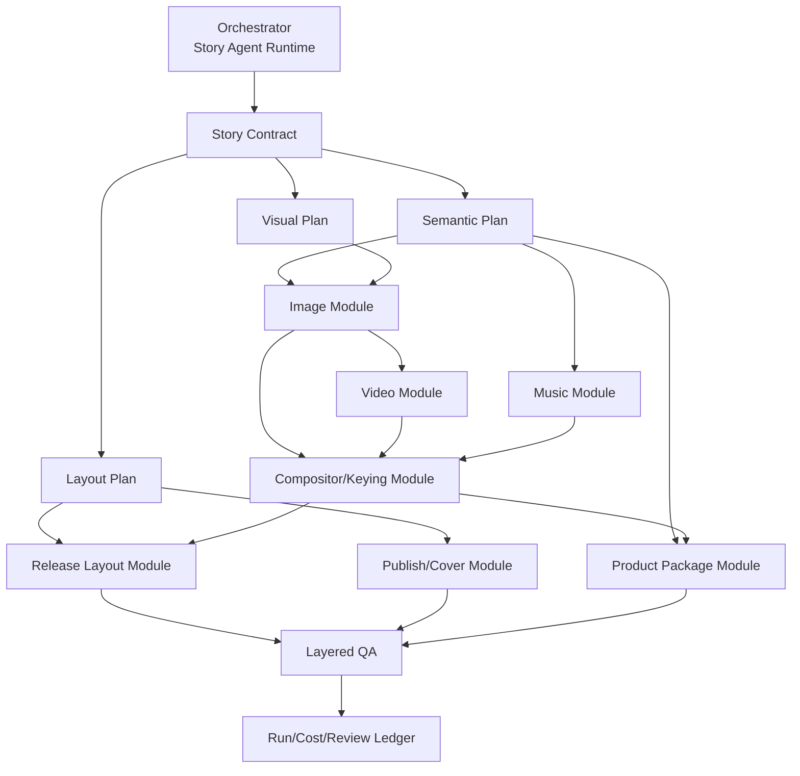

# Story Agent V3.5：质量修正与模块化升级

## 定位

V3.5 不是“把文件拆成更多类”的纯重构，也不是更换全部模型。它同时完成三件事：

1. 修复《小壁虎借尾巴》Feedback 暴露的真实质量问题。
2. 给生图、生视频、音乐、合成、发布视频、封面和资料包安装清晰接口，使各模块可单测、可调试、可替换。
3. 修复 Runtime 的增量重试、账本、成本、上下文、可观察性和审核层级。

V3.5 继续使用 Codex + GPT 体系。Sol 负责主脑与关键审核，Luna Max 负责执行；ImageGen、Grok Video 1.5、Suno、FFmpeg 原则上保持。此版本不接 DeepSeek，不做自动多供应商路由，不以“去 Codex”为目标。

## 非目标

- 不重做《小壁虎借尾巴》现有产物。
- 不一次性重写 V3 的 33 阶段 DAG；Milestone 1 仅增量加入两个前置阶段，当前为 35 阶段。
- 不同时接入 Flow/Omni、Seedance 等正式生产供应商。
- 不在这一阶段完成动态 PPT。
- 不先做模型档位大规模比较；可观察性和回归基准建立后再测。
- 不删除旧 CLI 或工作台兼容入口。

## 目标架构

“模块”以稳定输入输出合同为边界，不要求立刻拆成独立服务。第一步可以是 Python protocol/dataclass、JSON schema、CLI 和测试夹具。

## 工作流 A：真实质量修正

### A1. 产物语义矩阵

为每类产物明确处理 `pre-title / host intro / story announcement / story body / moral / outro` 的方式。

| 产物 | 主持人开场 | 报故事名 | 正文 | 道理 |
| --- | --- | --- | --- | --- |
| 客户文稿/朗读标注 | 去掉 | 去掉 | 保留 | 保留 |
| 示范视频字幕 | 保留 | 保留 | 保留 | 保留 |
| 背景视觉 | 显示标题卡 | 显示标题卡 | 故事镜头 | 道理视觉卡 |
| 销售字幕 | 去掉 | 去掉 | 保留 | 默认去掉，避免和画面文字重复 |
| PPT | 标题页 | 标题页 | 故事页 | 道理页，不重复大字幕 |

验收：首 15 秒和最后 15 秒必须有专门回归测试，不能只抽中段。

### A2. 生图前置合同

- 画风决策：普通儿童故事默认 3D 可爱卡通；文化/历史/用户指定才进入 2D 中国风。
- 角色卡：自然身份锚点、正侧背/表情、禁止项、同场比例。
- 世界尺度：用墙、鱼、牛、树、房屋等参照物描述相对范围。
- 状态机：允许故事特有中间状态，不限于通用四状态。
- 先生成风格锚点、主角设定和 2–3 个关键镜头；通过后冻结再批量出图。
- 审核维度增加：可爱度、审美、风格适配、比例、故事语义、关键角色吸引力。

验收：《小壁虎借尾巴》测试夹具必须能表达 `无尾 → 少量再生 → 进一步再生 → 完整`，但通用代码不能写死该故事。

### A3. 生视频质量

- 每镜显式写主体动作、环境动作、相机动作和相邻镜头衔接。
- 低运动、主体完全静止、用静态图替代视频均不得作为正式通过。
- 连续性失败优先局部提示/局部重生，不让“禁止变化”把整个角色锁死。
- Grok 1.5 仍为默认正式路径；通过能力接口声明只支持单图首帧。
- 为以后参考生视频预留 `reference_images/reference_videos/reference_audio`，V3.5 不实现自动路由。

### A4. 抠像和人物构图

- 候选证据固定含发丝、双肩、手臂、手部、裙边局部放大。
- 审核不只看完整和无裁切，还要判断边缘色差、溢绿、暗边、锯齿和背景融合。
- 示范视频保持原生人物构图；加右上角小号官方 Logo。
- A 镜保持同一人物缩放，只移动到中右分界；禁止为了塞进框而再次缩小。

### A5. 发布视频、PPT 和封面

- 主账号/宝库号上下包装改为两张独立的固定比例模板，版式确定、装饰可生成。
- 宝库号时长、年龄和标题使用锚点布局与中心偏移检查。
- PPT 字幕默认单行、小号、低黑条；按参考图做像素回归。
- 封面生成阶段禁文字和 Logo；后处理只放一个官方 Logo。
- 建立 3:4、4:3、16:9 × 有人/无人六套标题安全框、人物占位和中心线。

### A6. 朗读标注

- 输出标题改为 `《故事名》表演指导`，栏目名为“表演指导”。
- 重音先按主语、动作、对象/地点、角色称呼和关键功能词生成，再由节奏微调。
- 指导使用家长/幼师可立即执行的简单语言。
- 肢体动作只在自然且确有帮助时出现，并标“可选”。
- 用户只修重音不等于接受其他指导；反馈需细分字段。

## 工作流 B：模块化“装插座”

| 插座 | 最小输入 | 最小输出 | V3.5 当前实现 |
| --- | --- | --- | --- |
| `StorySemanticsPort` | 确认文本、字幕、时间轴 | 语义段和逐产物选择 | 封装现有 `story_semantics.py`，补产物矩阵。 |
| `VisualDesignPort` | 故事语义、用户风格偏好 | 视觉圣经、角色卡、尺度表、状态机 | GPT 生成 + 独立合同审核。 |
| `ImageGeneratorPort` | 镜头合同、参考资产 | 图片、元数据、请求记录 | Codex ImageGen。 |
| `VideoGeneratorPort` | 图片、动作计划、能力参数 | 逐镜视频、成本记录 | 现有 adapter + Grok 1.5。 |
| `MusicProviderPort` | 音乐分段计划 | 音源、许可/来源、QA | Ego Browser + Suno。 |
| `KeyerPort` | 绿幕源、候选参数 | alpha/合成、局部证据 | FFmpeg 色键。 |
| `CompositorPort` | 视频、音频、字幕、布局 | 背景成片、示范成片 | FFmpeg。 |
| `ReleaseLayoutPort` | 上下模板、A/B/C 计划、人物布局 | 主账号/宝库号成片 | 现有 `release_video.py` 渐进迁移。 |
| `PublishAssetPort` | 品牌规范、比例、人物/故事图 | 六封面和文案 | 生成背景 + 确定性排版。 |
| `ProductPackagePort` | 客户内容清单、PPT/文档策略 | 基础/进阶包 | 现有 `product_package.py` 渐进迁移。 |

每个插座必须提供：版本化 schema、能力声明、确定性验证、模拟实现、失败分类、成本/Token 事件和 CLI 诊断。V3.5 不要求它们成为网络服务。

## 工作流 C：Runtime、审核与成本

### C1. 分层审核

1. **机器完整性**：可读、尺寸、时长、目标文件、哈希、黑帧等。
2. **合同正确性**：视觉圣经、状态机、语义矩阵、品牌和布局合同本身先被独立审核。
3. **产物质量**：审美、可爱度、动效、抠像融合、版式与客户可用性。
4. **用户验收**：明确 `pass / changes_requested / rejected`，不能由 Agent 代填。

状态至少区分：`production_complete`、`internal_qa_passed`、`user_accepted`。

### C2. 增量重试

- 镜头、角色卡、模板、PPT 页和封面比例均有内容哈希。
- 改一镜只失效该镜视频及真正依赖它的汇总产物。
- 独立审核可以只审变化集 + 全局连续性锚点，不重新读整包。
- 每个重试有上限、原因、前后版本、隔离目录和成本。

### C3. 上下文与模型成本

- 阶段 context pack 只含合同、当前变化、必要证据和输出 schema。
- 确定性检查由脚本执行，不消耗模型上下文。
- 记录每个 Agent 的模型、推理档、输入/输出 Token、墙钟时间、父任务和结果。
- V3.5 默认仍是 Sol 主脑 + Luna Max 工人；有可比数据后再测 Luna X-high/Terra，不靠感觉切换。

### C4. 请求级账本

每次外部请求立即写入：

- provider、model、request_id、scene/artifact；
- submitted/completed/failed 时间；
- 输入哈希、秒数/张数/credits；
- 报价币种、估算、退款、实际账单；
- 首次生成还是哪一轮重试。

实际账单未知时状态必须是 `estimated`，不能 `settled`。

### C5. 用户可读的运行图

运行报告显示：阶段 DAG、当前关键路径、Sol/Luna 父子树、运行/等待/阻塞、资源锁、累计 Token/费用、预计剩余步骤。完成后能解释“18 小时花在哪里”，不再靠对话回忆。

## 实施顺序

### 里程碑 0：基线与测试夹具

- 冻结 V3 标签和证据哈希。
- 把 Feedback 问题映射成回归夹具与验收表。
- 不改生产行为。

### 里程碑 1：合同前置

- 产物语义矩阵。
- 风格/角色/尺度/状态机合同和独立审核。
- 品牌与发布布局合同。

这是最高优先级，因为它阻止错误批量扩散。

#### 实际完成状态（2026-08-13）

**已完成：**

- 七节版本化 JSON Schema、Python Validator 与 parity 测试；条件式预览、定性优先的尺度表达和 trusted provenance 四级优先级。
- `story_contract` / `story_contract_review` 两个前置阶段：Luna 草案、Sol 独立审核、标准 review bundle + SHA-256、Runtime crash-safe 确定性锁。
- 新任务 `required_v1` 高成本门禁；V3 历史任务只有绑定 eligibility receipt 时 `legacy_passthrough`，不补造合同或新审核。
- 六类最小 projection：分镜/生图与音乐为结构化 Agent 消费；图生视频、封面、发布视频、PPT/资料包的确定性规则进入 jobs/compiled spec/render/content selector。
- consumer manifest、completed receipt、封面 asset manifest、发布 render manifest 与产品中间 manifest 的合同绑定。
- 模块族级增量失效、付费视频请求前双重门禁、损坏/旧 SHA/resume 回归测试和只读 status/report 诊断。

**部分完成：**

- 只实现六个模块族的 section dependency mapping；没有逐镜头、逐页或单资产依赖图。
- 已有最小 compiled spec/adapter 接缝，但尚未把所有能力正式抽象成稳定 Port、能力声明和统一失败 schema。
- 合同审核保证规范正确和可追溯，不替代最终审美、动作、音乐适配、抠像与客户可用性审核。

**后续 Milestone 才做：**

- Feedback 对应的画风、角色尺度、动效、抠像、A 镜、PPT、封面和朗读标注质量修正。
- 更正式的 Port/adapter/schema 插座化与模拟供应商体系。
- Runtime 逐镜头增量重试、context pack、请求级账本、Agent tree/可观察性、Token/墙钟精确计量。
- 成本币种与真实账单修正，以及一条新故事的真实生产验证。

Milestone 1 完成不代表整个 V3.5 完成。

### 里程碑 2：质量修正

- 生图审美与比例门禁。
- 动效/静态降级门禁。
- 抠像、A 镜、片头、字幕、PPT、封面和朗读标注。

#### M2-2A 当前进度（2026-08-14）

**已完成 M2-2A0：** 从审核锁定的 `semantic_artifacts` 确定性编译逐产物语义呈现计划；标题/道理图卡、字幕互斥、首尾 15 秒语义回归和 legacy 兼容已落地。当前标题卡从 0 秒持续到第一条正文 cue；语义规则暂时接受，后续真实视觉验证需观察较长 host intro / announcement 是否造成标题卡停留过久，本轮不反向修改 A0。

**已完成 M2-2A1 机制：** 在正式批量生图前增加条件式 `visual_samples` 与独立 `visual_sample_review` 门禁。Runtime 优先复用已通过合同审核的预览；仅在故事实际需要且预览不足时补风格、角色、尺度或状态小样。审核分机器完整性、合同遵守和产品质量三层，P0 不受总分抵消；失败只进入对应小样重试。分镜计划绑定当前小样锁，并逐镜记录尺度依据、状态和视觉证据。

该项只证明离线质量机制和失效门禁已实现；真实 ImageGen 产品质量仍等待后续新故事小规模 canary 验证，不据此宣称真实供应商质量已经验证。

### 里程碑 3：模块接口

- 在不删除旧入口的前提下，为现有实现加 Port/adapter/schema。
- 用模拟供应商做单模块测试和故障注入。

### 里程碑 4：Runtime 增量化

- 镜头级失效图、context pack、请求账本、Agent 树。
- 跑一个新故事验证，而不是回头重做《小壁虎借尾巴》。

## 发布门槛

V3.5 候选版必须：

- 所有 V3 P0 问题有自动/独立审核覆盖或明确人工门禁；
- 新故事完整运行一次，且没有静态视频 fallback；
- 画风、角色小样、尺度和状态机在批量出图前通过；
- 首尾语义、片头、道理字幕、A 镜、六封面和 PPT 字幕全部通过基准图检查；
- 付费请求数、秒数、credits、币种和实扣状态可逐条复核；
- 失败只重做必要镜头/资产；
- 用户能从一次报告看懂关键路径和 Agent 树；
- 全量测试和旧 CLI 兼容测试通过；
- 用户对新样本完成终验后，才可以把版本状态从内部 QA 通过改为用户接受。
